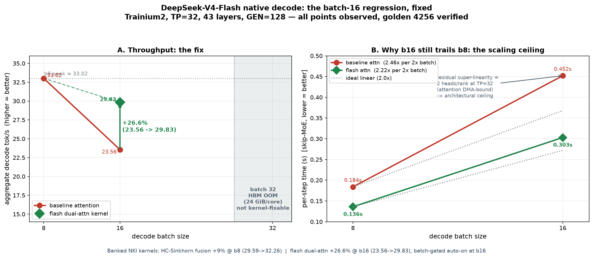

# DeepSeek-V4-Flash on Trainium2

Getting **DeepSeek-V4-Flash** (284B MoE, 43 layers, 256 routed experts, top-6, MLA with
compressed sparse attention) to decode on a single `trn2.48xlarge`, down two different
compilation paths, and measuring both honestly.

Everything here is self-measured. Where a number is not comparable to another number,
that is stated rather than glossed.

---

## The two paths

|  | [`xla/`](xla/) | [`native-pytorch/`](native-pytorch/) |
|---|---|---|
| how the graph reaches the hardware | `torch.compile` -> torch-xla -> HLO -> `neuronx-cc` | `torch.compile` -> torch-mlir -> StableHLO -> `neuronx-cc`, **no XLA** |
| status | working, tuned | **working**, un-tuned |
| best measured decode | **22.25 tok/s** @ batch 8 | **32.3 tok/s** @ batch 8 (fused HC-Sinkhorn NKI kernel: +9% over the same-build un-fused baseline; 5.0x over batch 1) |
| golden argmax | matches | matches |

**These two figures use different measurement conventions, so read them carefully.** The XLA
number is steady-state decode (prefill-excluded); the native number is aggregate over a
128-token generation. Decode on this model is weight-DMA-bound -- each step streams expert
weights out of HBM and does little math per token -- so batch size dominates throughput. The
one clean apples-to-apples is batch 1 vs batch 1: XLA measures **1.35 tok/s**, native **6.2**,
so the native path is well ahead at batch 1. The fuller picture: native decode reaches a
**5.0x aggregate at batch 8** (30.84 tok/s un-fused; a fused HC-Sinkhorn NKI kernel lifts this
~9% to 32.3, golden matched). Batch 16 originally *regressed* to 23.56 tok/s -- below batch 8 --
until a fused flash dual-attention kernel recovered it to **29.83 tok/s (+26.6%, golden matched)**
by removing an on-chip score-tensor spill; batch 32 does not fit at all (a hard HBM OOM at
24 GiB/core). The XLA path keeps gaining out to **37.81 tok/s at batch 128** because its expert
kernel already batches. The native ceiling is different in kind: at TP=32 this model has only
**2 attention heads per rank**, so decode attention is DMA/launch-bound and aggregate throughput
stays roughly flat across batch rather than climbing (see *Pushing decode throughput* below).

## Why bother with the native path at all

The XLA path scales further today (it keeps gaining out to batch 128, where the native path
is still HBM-capped at batch 8). The native path matters for what it makes possible
later, not for what it measures now:

- custom NKI kernels can be called directly instead of through an XLA lowering table
- the debug loop is minutes rather than hours -- no HLO dump, no rebuild
- data-dependent control flow traces under Dynamo, where XLA specialises per shape

None of that shows up in a tok/s number. It shows up in how quickly the next optimisation
can be attempted.

## Pushing decode throughput: what moved it, what didn't

Once the native path decoded correctly, the question was how much faster it could go. Every
result below is golden-argmax verified and compared against a *same-build* baseline so stack
drift can't masquerade as a win.

**At batch 8, a fused HC-Sinkhorn NKI kernel: +9%** (29.59 -> 32.3 tok/s, now on by default).
The hyper-connection boundary runs a Sinkhorn normalisation (two sigmoids, a row softmax,
~20 iteration steps) twice per layer -- 86 tiny-op sequences per decode step. Collapsing each
into a single kernel removes the launch/scheduling overhead that dominates at low batch.

A skip-block probe measured where the batch-8 step goes: **~74% attention, ~26% MoE.** Two more
kernels were written, simulator-validated, and run on-device. At batch 8 both were numerically
exact and neither was faster:

| kernel | correct | @ batch 8 | why (at batch 8) |
|---|---|---|---|
| fused HC-Sinkhorn | yes | **+9%** | many tiny ops, launch-overhead-bound -> fusion wins |
| dual-source attention (both score matmuls + shared online softmax + both output matmuls) | yes | -1% | batched GEMMs the compiler already lowers well |
| compressed-KV scatter write | yes | -2% | the existing full-buffer update is already memory-optimal |

At batch 8 the lesson looked clean: **NKI fusion pays off on op-overhead-bound work (many
small ops), not on compute-bound matmuls the compiler already schedules well.**

**Then batch 16 changed the picture.** Doubling the batch should raise throughput; instead it
*regressed* to 23.56 tok/s -- below batch 8. A skip-MoE decomposition put the blame on
attention, which scaled 2.46x per 2x batch (super-linear) even with the expert FFN removed.
The cause: the un-fused path materialises `[batch, heads, context]` score tensors that spill
on-chip at batch 16. The dual-source kernel that was *neutral at batch 8* turns out to be
exactly the fix -- it runs an online ("flash") softmax that never materialises the score
tensor and keeps its on-chip footprint independent of batch. On device: **batch 16
23.56 -> 29.83 tok/s (+26.6%), golden matched** (now batch-gated on at batch >= 16).

So the fusion lever was not spent at +9%. It buys throughput in **two** distinct regimes:
collapsing launch overhead (HC-Sinkhorn at batch 8) and removing an on-chip memory spill
(flash attention at batch 16). What it does *not* beat is a compute-bound GEMM the compiler
already schedules well -- which is exactly why the same attention kernel is neutral at batch 8
and a win at batch 16.

**The remaining ceiling is architectural, not a kernel.** Even with the flash kernel, batch 16
still scales 2.22x per 2x batch: at TP=32 this model has 64 heads / 32 = **2 heads per rank**,
so the attention matmuls run the systolic array at ~1.5% utilisation and decode attention is
bound by moving KV out of HBM, not by math -- so aggregate throughput stays about flat across
batch. Batch 32 does not run at all: a hard **HBM OOM** (24 GiB/core exhausted by KV cache +
activations for 32 sequences). The flash kernel shrinks the on-chip working set, not the HBM
KV cache, so it cannot help there. Closing the last gap needs the attention sharded over fewer
ranks than the rest of the model, or lower-precision KV -- not another kernel.

Reshaping parallelism didn't help either. Raising expert-parallel degree to 16 leaves zero
KV-cache budget (per-rank expert weight is EP-invariant, while the intermediate shard
doubles), and dropping it to 4 fails to build its collectives. And the next matmul-*reducing*
lever -- FP8/low-precision attention and expert GEMMs -- is implemented on the model side but
gated by compiler support for the FP8 format on this hardware generation.

Every kernel above was validated on a CPU simulator in minutes before it ever compiled for the
device, which is what made trying, keeping, and rejecting four kernels practical.



## What each folder contains

**[`xla/`](xla/)** -- the working baseline. Full 43-layer batched decode at 22.25 tok/s,
TP=32, batch 8, golden argmax matched. Four ceilings had to be cleared to get there, each
written up with the error it produces, because all four look like bugs in your own code.
Plus two supporting investigations: [`decode-static-shapes/`](xla/decode-static-shapes/)
(making decode shapes static, and two XLA traps) and
[`fp4-expert-gemm/`](xla/fp4-expert-gemm/) (why FP4 expert weights must be dequantised on
this hardware generation).

**[`native-pytorch/`](native-pytorch/)** -- the native path, and the 15 blockers between a
model that imports and a model that decodes. Includes
[`path-analysis/`](native-pytorch/path-analysis/) -- the full blocker writeup, including the
one that took days and turned out to be a single missing configuration flag -- and
[`hyper-connection-fusion/`](native-pytorch/hyper-connection-fusion/), seven NKI fusion
increments for the hyper-connection boundary, validated against float64 references, and
[`dual-attention-fusion/`](native-pytorch/dual-attention-fusion/), the fused flash
dual-attention kernel that fixes the batch-16 regression (+26.6%, golden matched).

## The model, briefly

```
43 decoder layers, hidden 4096, 64 attention heads, head_dim 512 (MLA, no absorption)
256 routed experts, top-6, moe_intermediate_size 2048, 1 shared expert
hyper-connections: hc_mult=4, 20 Sinkhorn iterations per boundary
compressed sparse attention: per-layer compress_ratios [0, 0, 4, 128, 4, 128, ...]
first 3 layers route by a token-id -> expert table instead of top-k
sliding window 128
```

Two properties dominate every engineering decision here. Decode is **weight-DMA-bound**, so
throughput is a memory-bandwidth story rather than a FLOPs story. And the per-layer
structure is **heterogeneous** -- a 4-layer slice covering `compress_ratios` `[0, 0, 4, 128]`
exercises every distinct layer type in the network, which makes a fast compile probe possible.
