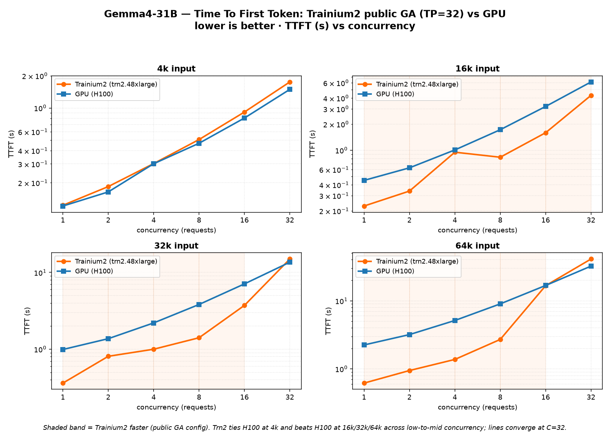

# Gemma4-31B — Trainium2 (public GA) vs GPU (H100/H200): TTFT comparison

Time-To-First-Token (prefill latency) for `google/gemma-4-31b-it`, **Trainium2**
(trn2.48xlarge, TP=32, **public GA** optimized config) vs a **GPU** baseline, across input
size (4k/16k/32k/64k) and concurrency (1→32). Lower is better. GPU baseline is **H100** (all
input sizes). Values are mean TTFT in **seconds**.

The Trainium2 numbers are the exact public-GA run recorded in [`RESULTS.md`](./RESULTS.md)
(seg=512 + prefix caching + fp8-KV ≥16k on the public vLLM-Neuron v0.21 DLC).

*(Regenerate the chart with `python3 make_perf_chart.py`.)*

## Headline
- **4k: Trainium2 ≈ H100.** Essentially a tie across all concurrency (within ~10–20%).
- **16k / 32k / 64k: Trainium2 beats H200** across low-to-mid concurrency — up to **~2×** at
  16k, **~2.7×** at 32k, and **~3.6×** at 64k (single stream).
- **Convergence at C=32.** At the highest concurrency for long context both platforms are
  KV/scheduling-bound and queueing dominates, so the lines meet (GPU marginally ahead at 32k/64k C=32).

## 4k input — TTFT (s)  ·  GPU = H100
| concurrency | Trainium2 (GA) | H100 | faster |
|---:|---:|---:|:--|
| 1  | 0.123 | 0.121 | ~tie |
| 2  | 0.184 | 0.164 | ~tie |
| 4  | 0.302 | 0.301 | ~tie |
| 8  | 0.507 | 0.468 | ~tie |
| 16 | 0.917 | 0.806 | ~tie |
| 32 | 1.754 | 1.494 | GPU 1.2× |

## 16k input — TTFT (s)  ·  GPU = H200
| concurrency | Trainium2 (GA) | H200 | faster |
|---:|---:|---:|:--|
| 1  | 0.227 | 0.449 | **Trn2 2.0×** |
| 2  | 0.338 | 0.627 | **Trn2 1.9×** |
| 4  | 0.950 | 1.009 | **Trn2 1.1×** |
| 8  | 0.831 | 1.727 | **Trn2 2.1×** |
| 16 | 1.595 | 3.207 | **Trn2 2.0×** |
| 32 | 4.307 | 6.156 | **Trn2 1.4×** |

## 32k input — TTFT (s)  ·  GPU = H200
| concurrency | Trainium2 (GA) | H200 | faster |
|---:|---:|---:|:--|
| 1  | 0.362 | 0.992 | **Trn2 2.7×** |
| 2  | 0.809 | 1.372 | **Trn2 1.7×** |
| 4  | 1.000 | 2.201 | **Trn2 2.2×** |
| 8  | 1.411 | 3.827 | **Trn2 2.7×** |
| 16 | 3.724 | 7.094 | **Trn2 1.9×** |
| 32 | 14.961 | 13.597 | GPU 1.1× |

## 64k input — TTFT (s)  ·  GPU = H200
| concurrency | Trainium2 (GA) | H200 | faster |
|---:|---:|---:|:--|
| 1  | 0.620 | 2.249 | **Trn2 3.6×** |
| 2  | 0.948 | 3.192 | **Trn2 3.4×** |
| 4  | 1.379 | 5.139 | **Trn2 3.7×** |
| 8  | 2.710 | 9.005 | **Trn2 3.3×** |
| 16 | 16.658 | 16.773 | ~tie |
| 32 | 40.990 | 32.258 | GPU 1.3× |

## Why the long-context win
Trainium2's TTFT stays low as context grows because the Gemma4 serve uses **segmented /
windowed attention** over the cached prefix (sliding-window layers gather a static number of KV
blocks at a dynamic offset), so prefill cost scales sub-linearly with context length. The GPU
baseline pays a steeper prefill cost as context grows, so at 16k/32k/64k the Trn2 single-stream
and mid-concurrency TTFT is materially lower — while at 4k the two are neck-and-neck.

## Notes
- **Metric:** mean TTFT (request sent → first output token). Only TTFT is compared here — GPU
  E2E/TPOT figures weren't part of this dataset.
- **Trn2 config:** trn2.48xlarge, TP=32, greedy, public GA optimized (seg=512 + prefix caching
  + fp8-KV ≥16k). Same run as [`RESULTS.md`](./RESULTS.md).
- **GPU baseline:** H100 (all input sizes), vendor-typical vLLM serving.
