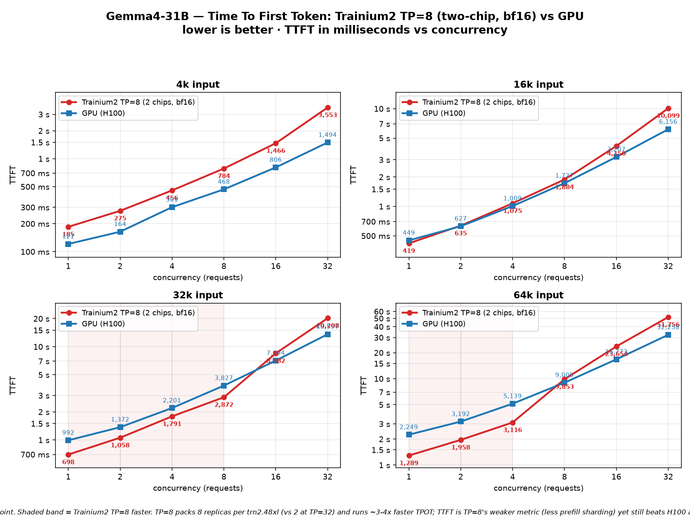
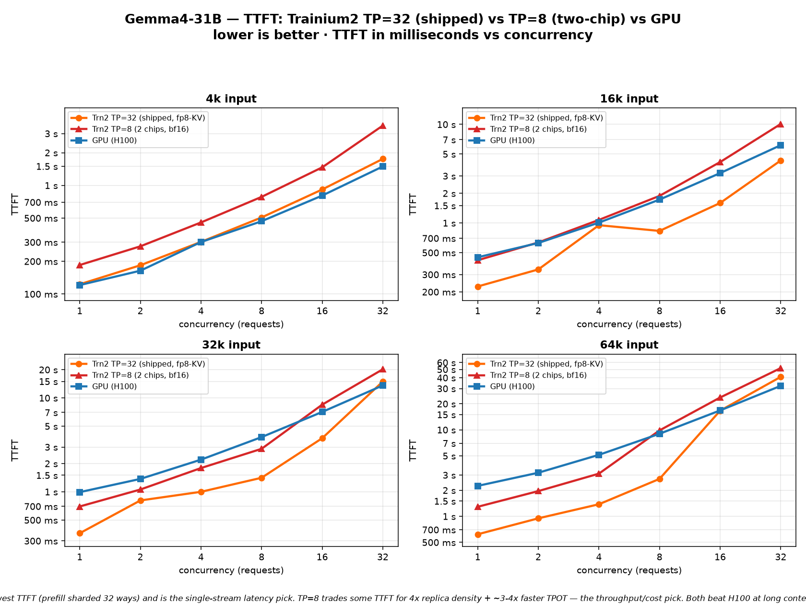

# Gemma4-31B — Trainium2 TP=8 (two-chip, bf16) TTFT: vs GPU and vs the shipped TP=32

A second view of Time-To-First-Token for `google/gemma-4-31b-it` on **Trainium2**, this time on
the **TP=8** config (2 NeuronCores-chips / 8 logical cores, bf16 KV) instead of the shipped TP=32.
Same benchmark harness, same input sizes (4k/16k/32k/64k) and concurrency (1→32), same H100 GPU
baseline. Lower is better; values are mean TTFT.

All four input sizes **fit at TP=8 bf16** on a single trn2.48xlarge — none OOM. (The earlier
"won't fit" note was for **TP=4** / one chip at ~24 GB, not TP=8.)

*(Regenerate both charts with `python3 make_perf_chart_tp8.py`.)*

## Read this first — what TP=8 is for
TTFT is **TP=32's strong metric**, not TP=8's: TP=32 shards the prefill matmuls 32 ways, so it
produces the first token fastest. TP=8's win is everywhere else:
- **~3–4× faster TPOT** (per-token decode) — 102 ms vs 460 ms at 4k, 268 ms vs 718 ms at 64k.
- **4× replica density** — TP=8 = 2 chips, so one trn2.48xl runs **8 replicas** vs **2** at TP=32.
- **Lower end-to-end latency** for typical short generations, because decode dominates E2E.

So the two charts answer two different questions:
- **TP=8 vs H100** — is the throughput/density config still TTFT-competitive? (Yes at long
  context, low concurrency.)
- **TP=32 vs TP=8 vs H100** — the explicit latency-vs-density tradeoff on one axis.

## TP=8 bf16 vs H100 — TTFT (s)
| size | conc | Trn2 TP=8 | H100 | faster |
|---|---:|---:|---:|:--|
| 4k  | 1  | 0.185 | 0.121 | GPU 1.5× |
| 4k  | 8  | 0.784 | 0.468 | GPU 1.7× |
| 4k  | 32 | 3.553 | 1.494 | GPU 2.4× |
| 16k | 1  | 0.419 | 0.449 | ~tie |
| 16k | 8  | 1.884 | 1.727 | ~tie |
| 16k | 32 | 10.099 | 6.156 | GPU 1.6× |
| 32k | 1  | 0.698 | 0.992 | **Trn2 1.4×** |
| 32k | 8  | 2.872 | 3.827 | **Trn2 1.3×** |
| 32k | 32 | 20.208 | 13.597 | GPU 1.5× |
| 64k | 1  | 1.289 | 2.249 | **Trn2 1.7×** |
| 64k | 4  | 3.116 | 5.139 | **Trn2 1.6×** |
| 64k | 32 | 51.756 | 32.258 | GPU 1.6× |

At long context + low/mid concurrency (the RAG regime: 32k/64k, C≤8) TP=8 still **beats H100 on
TTFT**. At 4k and at high concurrency, H100's TTFT is lower — that's the prefill-sharding gap,
which the shipped TP=32 config closes.

## TP=8 vs the shipped TP=32 — TTFT (s), single stream (conc=1)
| size | TP=32 (shipped) | TP=8 (2 chips) | TP=32 advantage |
|---|---:|---:|:--|
| 4k  | 0.123 | 0.185 | 1.5× lower TTFT |
| 16k | 0.227 | 0.419 | 1.8× |
| 32k | 0.362 | 0.698 | 1.9× |
| 64k | 0.620 | 1.289 | 2.1× |

TP=32 is ~1.5–2.1× lower TTFT single-stream. But on the same runs TP=8 is **2.7–4.5× lower TPOT**
and packs 4× the replicas — see `TP8_BF16_RESULTS.md` for the full TPOT/E2E/throughput tables.

## Bottom line
- **Latency-first, single stream:** TP=32 (shipped) — lowest TTFT.
- **Throughput / cost-per-token / packing many replicas:** TP=8 bf16 — 4× density, 3–4× faster
  decode, and still TTFT-competitive with H100 at long context.
- Both Trainium2 configs beat H100 on long-context TTFT at low-to-mid concurrency.

## Notes
- **Metric:** mean TTFT (request sent → first output token).
- **Trn2 TP=8:** trn2.48xlarge, TP=8 (2 chips, LNC2), greedy, seg=512 + prefix caching, bf16 KV,
  public vLLM-Neuron v0.21 DLC. Full sweep 1→32, gen=40. Source JSONs: `results/tp8/{4k,16k,32k,64k}.json`.
- **Trn2 TP=32:** the shipped public-GA config (seg=512 + prefix caching + fp8-KV ≥16k), same run
  as `RESULTS.md` / `PERF_VS_GPU.md`.
- **GPU baseline:** H100 (all input sizes), vendor-typical vLLM serving.
