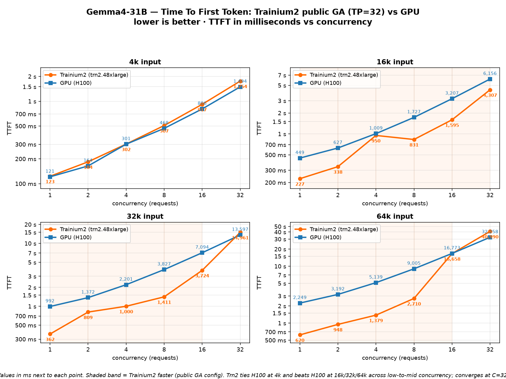

# Gemma4-31B on Trainium2 — PUBLIC GA (vLLM-Neuron v0.21 / Neuron SDK 2.31)

Serve and benchmark **`google/gemma-4-31b-it`** on AWS Trainium2 (trn2.48xlarge, TP=32)
using the **publicly available (GA)** vLLM NeuronX Deep Learning Container — **no private-beta
ECR image required**. This is the drop-and-ship path for the general-availability stack.

This is the public / GA counterpart of the private-beta example
[`../vllm-neuron-4k_16k_32k_64k`](../vllm-neuron-4k_16k_32k_64k). Same Gemma4 model code,
same benchmark methodology (4k/16k/32k/64k × concurrency 1–32, 40 output tokens), running
on the public stack. Measured numbers: [`RESULTS.md`](./RESULTS.md).

> ## 👉 New here? Start with [`LAUNCH.md`](./LAUNCH.md)
> A dead-simple, copy-paste, step-by-step runbook from a bare trn2 instance all the way to
> results — no prior Neuron/vLLM knowledge needed. The "Quick start" below is the short version
> for people who already have the box and weights set up.

## Why a separate example
The private-beta example loads the Gemma4 model via `PYTHONPATH` + `sitecustomize.py` into the
beta plugin (vLLM 0.19). The public DLC ships **vLLM 0.21 / Neuron SDK 2.31** with a different
plugin layout, so here the model is **installed in place** into `vllm_neuron/model/gemma4` and
registered in `vllm_neuron/model/registry.py` (via [`install_public.sh`](./install_public.sh)).
Chunked/segmented prefill for Gemma4's heterogeneous head dims (256 sliding / 512 global) works
out-of-the-box on the public segmented-CTE path — no kernel patch needed.

## Container image
```
public.ecr.aws/neuron/pytorch-inference-vllm-neuronx:0.21.0.1.0.0-neuronx-py313-sdk2.31.0-ubuntu24.04
```

## Contents
| file | purpose |
|---|---|
| `serving_pkg/gemma4/` | the Gemma4 model implementation (model.py, config, factory, kernels) |
| `install_public.sh` | deploy `gemma4/` into the DLC's `vllm_neuron/model` + register the arch |
| `make_local_model.py` | build a text-only model dir (strips vision/audio config + tokenizer fix) |
| `launch_serve_public.sh` | launch one serve config, wait until ready |
| `run_benchmark_public.sh` | full suite: launches a server per input size, sweeps concurrency |
| `bench.py` / `summarize.py` | TTFT/TPOT/E2E measurement + summary table |
| `results/` | published per-size JSON + summary from a reference run |

## Quick start (inside the public DLC container)

Assumes a trn2.48xlarge with the Gemma4 weights in the HF cache and all 16 Neuron devices
mounted into the container (see the launch runbook in the sibling example for host setup).

```bash
# 0. inside the DLC container, with this directory available
cd vllm-neuron-4k_16k_32k_64_PublicVLLM

# 1. install the model into the plugin + register the architecture
bash install_public.sh

# 2. build the local text-only model dir (drops vision/audio, patches tokenizer)
python3 make_local_model.py          # -> ~/models/gemma-4-31b-it

# 3a. run the full benchmark suite (server per input size; first launch compiles ~10-20 min)
MODEL=~/models/gemma-4-31b-it bash run_benchmark_public.sh

# 3b. or just serve one config and hit it
LEN=5120 SEG=512 BUCKETS=512 MNS=32 KV_CACHE_DTYPE=auto APC=1 \
  MODEL=~/models/gemma-4-31b-it bash launch_serve_public.sh
```

Correct prompting (it's an instruction-tuned model — use the chat endpoint / chat template):
```bash
curl -s http://localhost:8000/v1/chat/completions -H 'Content-Type: application/json' \
  -d '{"model":"gemma4","messages":[{"role":"user","content":"What is the capital of France?"}],
       "max_tokens":16,"temperature":0}'
# -> "Paris"
```

## Notes
- **Instruction-tuned model:** raw `/v1/completions` on a bare prompt (no chat template) will
  produce degenerate continuations — that is expected behavior for an -IT model and matches the
  HuggingFace reference exactly. Use `/v1/chat/completions` (or apply the Gemma chat template).
- **Optimized config:** `seg=512` (segmented prefill) + `--enable-prefix-caching` (APC) +
  `fp8_e4m3` KV cache at ≥16k. This is the RAG pattern (shared context prefix cached, unique
  short query per request).
- **Optional v2 NKI prefill kernel:** off by default (`GEMMA4_V2_PREFILL=1` to opt in). The
  stock segmented-CTE prefill path is already fast on the public stack; the published numbers
  use the default.

## Trainium2 (public GA) vs GPU (H100) — TTFT comparison

Time-To-First-Token for `google/gemma-4-31b-it`, **Trainium2** (trn2.48xlarge, TP=32, public GA
optimized config) vs an **H100** baseline (all input sizes), across input size and concurrency
(1→32). Lower is better. Trn2 numbers are the same public-GA run recorded in
[`RESULTS.md`](./RESULTS.md). Standalone doc: [`PERF_VS_GPU.md`](./PERF_VS_GPU.md).



**Headline**
- **4k: Trainium2 ≈ H100** — essentially a tie across all concurrency (within ~10–20%).
- **16k / 32k / 64k: Trainium2 beats H100** across low-to-mid concurrency — up to **~2×** at 16k,
  **~2.7×** at 32k, and **~3.6×** at 64k (single stream).
- **Convergence at C=32** — at the highest concurrency for long context both platforms are
  KV/scheduling-bound and queueing dominates (GPU marginally ahead at 32k/64k C=32).

**4k input — TTFT (s) · GPU = H100**
| concurrency | Trainium2 (GA) | H100 | faster |
|---:|---:|---:|:--|
| 1  | 0.123 | 0.121 | ~tie |
| 2  | 0.184 | 0.164 | ~tie |
| 4  | 0.302 | 0.301 | ~tie |
| 8  | 0.507 | 0.468 | ~tie |
| 16 | 0.917 | 0.806 | ~tie |
| 32 | 1.754 | 1.494 | GPU 1.2× |

**16k input — TTFT (s) · GPU = H100**
| concurrency | Trainium2 (GA) | H100 | faster |
|---:|---:|---:|:--|
| 1  | 0.227 | 0.449 | **Trn2 2.0×** |
| 2  | 0.338 | 0.627 | **Trn2 1.9×** |
| 4  | 0.950 | 1.009 | **Trn2 1.1×** |
| 8  | 0.831 | 1.727 | **Trn2 2.1×** |
| 16 | 1.595 | 3.207 | **Trn2 2.0×** |
| 32 | 4.307 | 6.156 | **Trn2 1.4×** |

**32k input — TTFT (s) · GPU = H100**
| concurrency | Trainium2 (GA) | H100 | faster |
|---:|---:|---:|:--|
| 1  | 0.362 | 0.992 | **Trn2 2.7×** |
| 2  | 0.809 | 1.372 | **Trn2 1.7×** |
| 4  | 1.000 | 2.201 | **Trn2 2.2×** |
| 8  | 1.411 | 3.827 | **Trn2 2.7×** |
| 16 | 3.724 | 7.094 | **Trn2 1.9×** |
| 32 | 14.961 | 13.597 | GPU 1.1× |

**64k input — TTFT (s) · GPU = H100**
| concurrency | Trainium2 (GA) | H100 | faster |
|---:|---:|---:|:--|
| 1  | 0.620 | 2.249 | **Trn2 3.6×** |
| 2  | 0.948 | 3.192 | **Trn2 3.4×** |
| 4  | 1.379 | 5.139 | **Trn2 3.7×** |
| 8  | 2.710 | 9.005 | **Trn2 3.3×** |
| 16 | 16.658 | 16.773 | ~tie |
| 32 | 40.990 | 32.258 | GPU 1.3× |

**Why the long-context win** — Trainium2's TTFT stays low as context grows because the Gemma4
serve uses segmented / windowed attention over the cached prefix (sliding-window layers gather a
static number of KV blocks at a dynamic offset), so prefill cost scales sub-linearly with context
length. The H100 baseline pays a steeper prefill cost as context grows, so at 16k/32k/64k the Trn2
single-stream and mid-concurrency TTFT is materially lower — while at 4k the two are neck-and-neck.

*Metric: mean TTFT (request sent → first output token). Trn2 = trn2.48xlarge, TP=32, greedy,
public GA optimized config. GPU baseline: H100 (all sizes), vendor-typical vLLM serving.*
