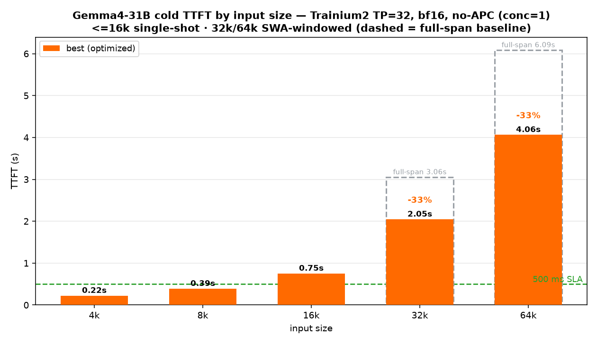
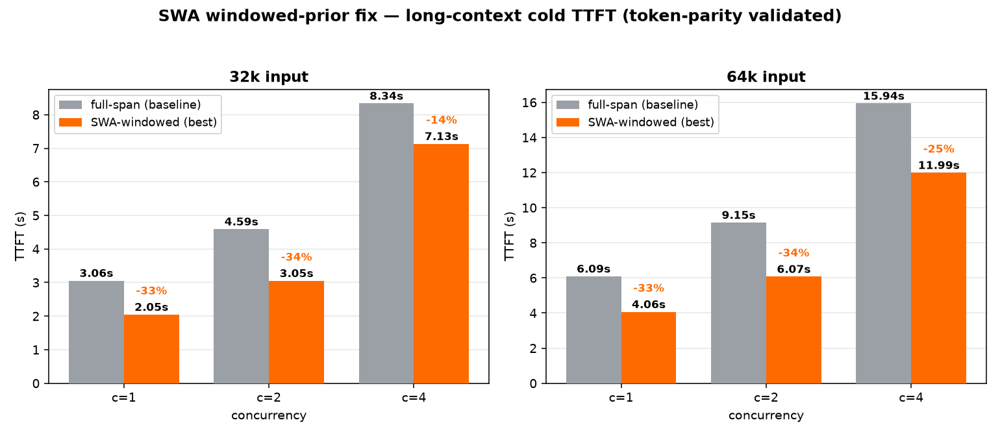
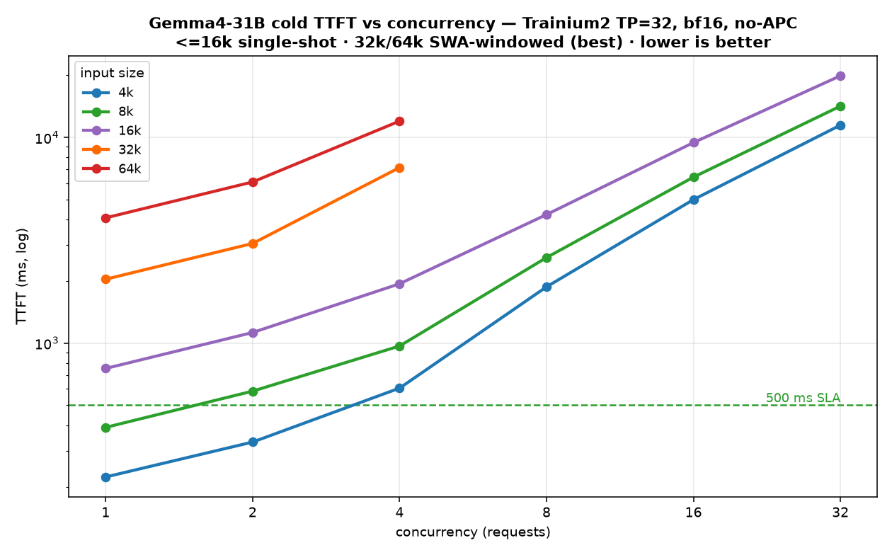

# Gemma4-31B on AWS Trainium2 — cold TTFT benchmark (no-APC, bf16, honest worst-case)

Serve and benchmark **`google/gemma-4-31b-it`** on AWS Trainium2 (trn2.48xlarge, TP=32) and measure
**true cold prefill TTFT** across input sizes **4k / 8k / 16k / 32k / 64k** and a concurrency sweep,
40 output tokens. **No prefix caching, bf16 KV (no FP8), a unique random prompt on every request** —
so nothing can be served from cache. Every number here is a genuine cold prefill.

This is the honest, apples-to-apples counterpart of the APC/cache-hit sibling
[`../vllm-neuron-4k_16k_32k_64_PublicVLLM`](../vllm-neuron-4k_16k_32k_64_PublicVLLM).

## 🏆 Headline — cold TTFT by input size (conc=1)



| input | 4k | 8k | 16k | 32k | 64k |
|---|---:|---:|---:|---:|---:|
| **TTFT (conc=1)** | **0.22 s** | **0.39 s** | **0.75 s** | **2.05 s** | **4.06 s** |
| prefill path | single-shot | single-shot | single-shot | seg + **SWA-windowed** | seg + **SWA-windowed** |
| vs full-span | — | — | — | 3.06 s (**−33%**) | 6.09 s (**−33%**) |

- **≤8k clears the 500 ms TTFT SLA cold** (0.22 / 0.39 s) — the dominant RAG traffic.
- **16k = 0.75 s** cold, single-shot.
- **32k / 64k use the validated SWA windowed-prior fix** → **−33%** vs the full-span segmented path,
  with **byte-identical output** (token parity). See [`SWA_WINDOW_FINDING.md`](./SWA_WINDOW_FINDING.md).

## The long-context win — SWA windowed prior (−33%, correctness-preserving)



Above 16k, prefill is segmented (chunked). The stock path re-gathers the **full** prior-KV span for
**every** layer — but the **50 of 60 sliding-window layers** only ever attend to the last 1024 keys.
Windowing the SWA-layer prior to its trailing ~1024 tokens (static shape, dynamic offset) cuts that
waste. It is **numerically exact** (the kernel's causal + sliding-window masks are shift-invariant),
proven three ways: CPU masking (2.4e-7), CPU gather plumbing (0.0), and on-device token parity
(byte-identical greedy tokens at 18k). Patch: [`patches/patch_swa_window_prior_v2.py`](./patches/patch_swa_window_prior_v2.py).

| conc | 32k full-span | 32k windowed | Δ | 64k full-span | 64k windowed | Δ |
|---:|---:|---:|:--:|---:|---:|:--:|
| 1 | 3.06 s | **2.05 s** | −33% | 6.09 s | **4.06 s** | −33% |
| 2 | 4.59 s | **3.05 s** | −34% | 9.15 s | **6.07 s** | −34% |
| 4 | 8.34 s | **7.13 s** | −14% | 15.94 s | **11.99 s** | −25% |

(The win is largest at low/mid concurrency; at conc=4 for long context, bf16 KV capacity starts to
queue requests, so the fixed savings are a smaller fraction of the total.)

## Cold TTFT vs concurrency (best config, all sizes)



Full tables (TTFT / TPOT / E2E, all concurrency levels): **[RESULTS.md](./RESULTS.md)**.

| conc | 4k | 8k | 16k | 32k | 64k |
|---:|---:|---:|---:|---:|---:|
| 1  | 0.224 | 0.390 | 0.754 | **2.046** | **4.064** |
| 2  | 0.331 | 0.585 | 1.127 | **3.051** | **6.071** |
| 4  | 0.605 | 0.969 | 1.944 | **7.132** | **11.991** |
| 8  | 1.878 | 2.606 | 4.215 | — | — |
| 16 | 4.983 | 6.406 | 9.429 | — | — |
| 32 | 11.459 | 14.176 | 19.901 | — | — |

(32k/64k stop at conc=4: bf16 KV capacity is exhausted before conc=8 at long context, so higher
levels are head-of-line-queue-bound, not a meaningful single-request number. Use multiple replicas
for concurrent long-context. 32k/64k are the **SWA-windowed** best numbers.)

## Why this is the honest cold number (vs the APC sibling)

| | sibling folder (APC) | **this folder (no-APC)** |
|---|---|---|
| prefix caching (APC) | **on** | **off** |
| KV cache | fp8_e4m3 (≥16k) | **bf16** |
| prefill | segmented seg=512 | **single-shot ≤16k**, segmented + SWA-windowed >16k |
| workload | shared prefix + short query → **cache hit** | **unique random prompt every request → cold** |
| what it measures | best-case repeated-context (RAG) TTFT | **true cold-prefill TTFT** |

The sibling's headline is a *cache-hit* number (shared prefix warmed once, then reused — only the short
unique tail is prefilled). Real and useful for RAG, but **not comparable to a cold request**. This
folder removes that advantage entirely. The two are complementary, not competing.

## Just want to run it? → [LAUNCH.md](./LAUNCH.md)

## Reproduce in 3 steps
1. **Set up the container** — [SETUP.md](./SETUP.md).
2. **Get this benchmark (in the container):**
   ```bash
   git clone https://github.com/arminagha1234/Armin-Neuron.git
   cd Armin-Neuron/gemma4-31b/vllm-neuron-4k_16k_32k_64k_no_APC
   ```
3. **Run it:**
   ```bash
   MODEL=/root/models/gemma-4-31b-it bash run_benchmark.sh
   ```
   It launches a **single-shot** server (LEN=16384) for 4k/8k/16k and a **segmented** server
   (LEN=66560, seg=8192) for 32k/64k, runs the concurrency sweep with unique random prompts, and
   writes `results_<timestamp>/` (per-size JSON + `summary.txt` + `summary.csv`).
   For the −33% long-context numbers, apply the windowed-prior patch first:
   `python3 patches/patch_swa_window_prior_v2.py` (backs up model.py; see the finding doc).

   Regenerate the charts: `python3 make_perf_chart.py` → `assets/*.png`.

## What "single-shot" means (it is not a vLLM flag)
The vLLM-Neuron plugin prefills the whole prompt in one pass when
**`--max-num-batched-tokens == --max-model-len`** (and `max_model_len ≤ 16384`, the plugin's
single-shot cap). When `mnbt < max-model-len` you get **segmented** prefill (chunk ∈ {512…8192}).
`launch_serve.sh` sets `SEG==LEN` for single-shot, `SEG<LEN` for segmented. There is no `--single-shot` flag.

> **Why >16k is segmented:** single-shot above 16k is a hard compiler limit — raising the cap and
> compiling a 32k single-shot graph does **not** OOM but **stalls neuronx-cc** on the hd512
> global-attention graph. Tested directly. Hence the SWA-windowed segmented path is the best >16k option.

## Configuration (defaults)

| Variable | Default | Notes |
|---|---|---|
| `GEN` | `40` | output tokens |
| `LEVELS` | `1,2,4,8,16,32` | concurrency (≤16k) |
| `LEVELS_LONG` | `1,2,4` | 32k/64k — high concurrency is KV-capacity-bound (queues) |
| `ONLY` | `4k,8k,16k,32k,64k` | input sizes |
| `TP` | `32` | tensor-parallel size |
| `MNS` | `32` | max-num-seqs |
| **`APC`** | **`0`** | **prefix caching OFF** (the whole point of this folder) |
| **KV cache** | **bf16** | no FP8 |
| `MODEL` | `google/gemma-4-31B-it` | HF id or local path |

## Files
- `README.md` — this file (best numbers + charts)
- `make_perf_chart.py` — regenerates `assets/*.png` from the measured numbers
- `assets/` — the TTFT charts
- `RESULTS.md` — full measured TTFT / TPOT / E2E tables (no-APC, cold)
- `SWA_WINDOW_FINDING.md` — the validated windowed-prior fix (−33%, parity-proven)
- `LAUNCH.md` / `SETUP.md` — runbook + container setup
- `run_benchmark.sh` — main entry (single-shot ≤16k + segmented >16k, APC off)
- `launch_serve.sh` — launches one server; `SEG==LEN` → single-shot, `SEG<LEN` → segmented
- `bench_random.py` — **unique-random-prompt** concurrency client (defeats prefix caching), stdlib only
- `summarize.py` — combines per-size results into one table + CSV
- `patches/` — model-side changes for best TTFT: `patch_qkv_proj.py` (fused QKV+QK-norm+RoPE),
  `patch_oproj.py` (o_proj NKI kernel), `patch_segmented_nki.py` (>16k segmented→NKI flash),
  **`patch_swa_window_prior_v2.py` (the validated −33% long-context fix)**,
  `swa_window_validate{,2}.py` (CPU correctness proofs), `parity_check.py` (token-parity gate)
- `serving_pkg/` — Gemma4-31B model + vLLM-Neuron registration

## Notes
- Every number is **cold** — no prefix-cache reuse. For repeated-context / RAG best-case, see the APC sibling.
- **Instruction-tuned model:** use `/v1/chat/completions` (or the chat template). A bare `/v1/completions`
  prompt produces degenerate continuations — expected for an -IT model, matches HF exactly.
- TPOT (~94 ms/token ≤16k) is sdpa decode; a throughput/$-per-token factor, not TTFT. It's
  weight-bandwidth-bound at conc=1/bf16 (flat across context); fusing the decode qkv/o_proj into the
  prefill NKI kernels was tested and is **2.3× slower** at decode (T=1), so the torch decode path is optimal.
- High concurrency at 32k/64k is KV-capacity-bound (bf16) — requests queue; FP8-KV would raise that
  ceiling but is intentionally out of scope here (bf16-only).
