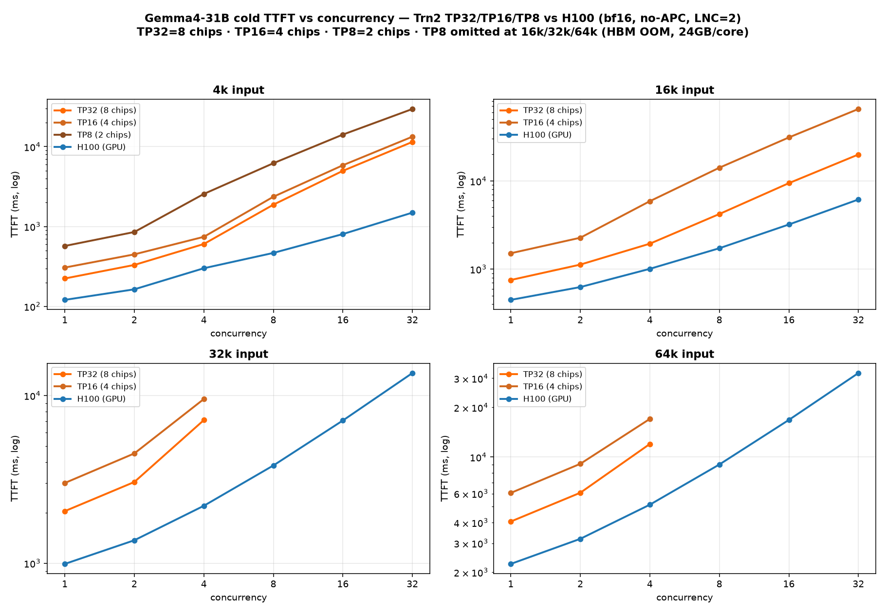
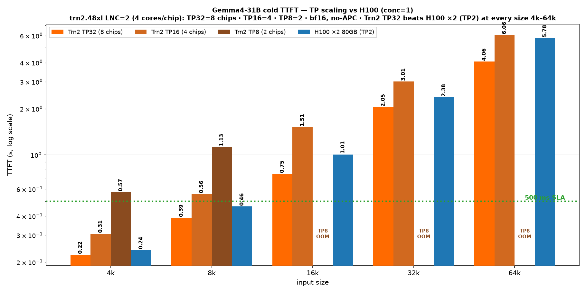

# Gemma4-31B on AWS Trainium2 — cold TTFT benchmark (no-APC, bf16, honest worst-case)

> ### New here? Start with this.
>
> **What this is:** honest *cold* first-token latency (TTFT) for Gemma4-31B served on a single
> AWS Trainium2 box (trn2.48xlarge), across 4k–64k input — prefix caching **off** and a unique
> prompt on every request, so nothing is served from cache. The deliberate worst case, not a
> cache-hit number.
>
> **Bottom line:** Trn2 (TP=32, 8 chips) serves cold in ~0.22 s @4k, ~0.75 s @16k, ~4.06 s @64k —
> **faster than a comparable-scale 2-GPU H100 (×2 80GB) at every size.**
>
> **Want to reproduce it?** → **[LAUNCH.md](./LAUNCH.md)** is a copy-paste, line-by-line runbook.
> First check you can clear these three gates — nothing runs without them:
> 1. a **trn2.48xlarge** (Trainium2) — reserved via **Capacity Blocks**, not on-demand
> 2. **vLLM-Neuron Beta image access** — your AWS account must be granted ECR pull by the Neuron team
> 3. **Gemma4-31B weights** — gated on Hugging Face (accept the license), or provided out-of-band
>
> **Glossary:** *cold* = no cache reuse · *no-APC* = automatic prefix caching off · *TTFT* = time to
> first token · *single-shot vs segmented* = prompt prefilled in one pass vs chunks (explained below).

Serve and benchmark **`google/gemma-4-31b-it`** on AWS Trainium2 (trn2.48xlarge, TP=32) and measure
**true cold prefill TTFT** across input sizes **4k / 8k / 16k / 32k / 64k** and a concurrency sweep,
40 output tokens. **No prefix caching, bf16 KV (no FP8), a unique random prompt on every request** —
so nothing can be served from cache. Every number here is a genuine cold prefill.

This is the honest, apples-to-apples counterpart of the APC/cache-hit sibling
[`../vllm-neuron-4k_16k_32k_64_PublicVLLM`](../vllm-neuron-4k_16k_32k_64_PublicVLLM).

## TP scaling — TP32 vs TP16 vs TP8 vs H100 (cold TTFT)

This no-APC cold benchmark runs at **TP=32** — the lowest-TTFT config. On trn2.48xlarge with **LNC=2**
(`logical-neuroncore-config: 2`): 16 chips × 4 logical cores = 64 cores, 96 GB/chip = **24 GB per
core**. TP maps 1 rank → 1 logical core (4 per chip), so **TP=32 = 8 chips**, **TP=16 = 4 chips**,
**TP=8 = 2 chips**. Here is how cold TTFT scales as you shard across fewer chips, vs an H100 baseline.

### Cold TTFT vs concurrency — TP32 / TP16 / TP8 vs H100



*LNC=2 → **TP32 = 8 chips**, **TP16 = 4 chips**, **TP8 = 2 chips** (4 logical cores/chip, 24 GB/core). TP8 is omitted at 16k/32k/64k because it HBM-OOMs there.*

### conc=1 scaling by input size



**conc=1 TTFT (s):**
| size | TP32 (8 chips) | TP16 (4 chips) | TP8 (2 chips) | **H100 ×2 80GB (TP2)** |
|---|---:|---:|---:|---:|
| 4k | **0.224** | 0.307 | 0.572 | 0.240 |
| 8k | **0.390** | 0.557 | 1.126 | 0.461 |
| 16k | **0.754** | 1.515 † | **OOM** | 1.008 |
| 32k | **2.046** | 3.01 | **OOM** | 2.377 ‡ |
| 64k | **4.064** | 6.056 | **OOM** | 5.778 |

† TP16 16k measured via the segmented path (single-shot 16k needs prompt headroom under the 16384 cap).
‡ `H100 ×2 80GB (TP2)` 32k/64k measured with longer output (4k/8k/16k use 40); TTFT is first-token latency, so output length does not affect it. Even at **64k, Trn2 TP32 (4.064 s) beats the 2× H100 80GB config (5.778 s)** cold.

**What the TP sweep shows:**
- **TP32 has the lowest TTFT** — it shards the prefill matmuls across the most cores, so first-token
  latency is best. TP16 is ~40–50% higher; TP8 is ~2.5–3× higher.
- **TP8 cannot serve long context in bf16.** The 64k-capacity config **HBM-OOMs** on its 8 cores /
  **2 chips** (`NCC_EOOM002`: peak **27.45 GB > 24 GB** per-core Trn2 limit). TP8 is a
  **short-context / high-density** config (2 chips ⇒ up to **8 replicas per box**, ~3–4× faster
  decode) — not a long-context or lowest-TTFT one.
- **OOM reconciliation:** a "seg=8192 OOMs at ~30 GB > 24 GB" observation is a **low-TP** OOM, *not*
  TP32. At TP32 the same seg=8192 config shards 32 ways and fits (that's the measured 2.05 s at 32k).
  Fewer cores → more per-core HBM → OOM. Same config, different TP → different outcome.

**Note on the H100 comparison:** these are Trn2's **cold / bf16 / no-APC worst-case** numbers. Against a
comparable-scale **`H100 ×2 80GB (TP2)`** (2 GPUs), **Trn2 TP32 (8 chips) is *faster* at every size
even cold** (0.224/0.390/0.754/2.046/4.064 vs 0.240/0.461/1.008/2.377/5.778 s) — including **64k, where
Trn2 TP32 (4.06 s) beats the 2× H100 80GB config (5.78 s)**. Trn2's win widens further in the **APC / RAG config**
(fp8-KV cache-hits) — see the sibling
[`../vllm-neuron-4k_16k_32k_64_PublicVLLM`](../vllm-neuron-4k_16k_32k_64_PublicVLLM). This folder is
the honest cold floor; TP8/TP16's real value is throughput / $-per-token and replica density, not cold TTFT.

## Just want to run it? → [LAUNCH.md](./LAUNCH.md)

## Reproduce in 3 steps
1. **Set up the container** — [SETUP.md](./SETUP.md).
2. **Get this benchmark (in the container):**
   ```bash
   git clone https://github.com/arminagha1234/Armin-Neuron.git
   cd Armin-Neuron/gemma4-31b/vllm-neuron-4k_16k_32k_64k_no_APC
   ```
3. **Run it:**
   ```bash
   MODEL=/root/models/gemma-4-31b-it bash run_benchmark.sh
   ```
   It launches a **single-shot** server (LEN=16384) for 4k/8k/16k and a **segmented** server
   (LEN=66560, seg=8192) for 32k/64k, runs the concurrency sweep with unique random prompts, and
   writes `results_<timestamp>/` (per-size JSON + `summary.txt` + `summary.csv`).
   For the −33% long-context numbers, apply the windowed-prior patch first:
   `python3 patches/patch_swa_window_prior_v2.py` (backs up model.py; see the finding doc).

   Regenerate the charts: `python3 make_perf_chart.py` → `assets/*.png`.

## What "single-shot" means (it is not a vLLM flag)
The vLLM-Neuron plugin prefills the whole prompt in one pass when
**`--max-num-batched-tokens == --max-model-len`** (and `max_model_len ≤ 16384`, the plugin's
single-shot cap). When `mnbt < max-model-len` you get **segmented** prefill (chunk ∈ {512…8192}).
`launch_serve.sh` sets `SEG==LEN` for single-shot, `SEG<LEN` for segmented. There is no `--single-shot` flag.

> **Why >16k is segmented:** single-shot above 16k is a hard compiler limit — raising the cap and
> compiling a 32k single-shot graph does **not** OOM but **stalls neuronx-cc** on the hd512
> global-attention graph. Tested directly. Hence the SWA-windowed segmented path is the best >16k option.

## Configuration (defaults)

| Variable | Default | Notes |
|---|---|---|
| `GEN` | `40` | output tokens |
| `LEVELS` | `1,2,4,8,16,32` | concurrency (≤16k) |
| `LEVELS_LONG` | `1,2,4` | 32k/64k — high concurrency is KV-capacity-bound (queues) |
| `ONLY` | `4k,8k,16k,32k,64k` | input sizes |
| `TP` | `32` | tensor-parallel size |
| `MNS` | `32` | max-num-seqs |
| **`APC`** | **`0`** | **prefix caching OFF** (the whole point of this folder) |
| **KV cache** | **bf16** | no FP8 |
| `MODEL` | `google/gemma-4-31B-it` | HF id or local path |

## Files
- `README.md` — this file (best numbers + charts)
- `make_perf_chart.py` / `make_perf_chart_tp.py` — regenerate the `assets/*.png` (best-numbers charts + TP32/TP16/TP8-vs-H100 scaling charts) from the measured numbers
- `assets/` — the TTFT charts
- `RESULTS.md` — full measured TTFT / TPOT / E2E tables (no-APC, cold)
- `SWA_WINDOW_FINDING.md` — the validated windowed-prior fix (−33%, parity-proven)
- `LAUNCH.md` / `SETUP.md` — runbook + container setup
- `run_benchmark.sh` — main entry (single-shot ≤16k + segmented >16k, APC off)
- `launch_serve.sh` — launches one server; `SEG==LEN` → single-shot, `SEG<LEN` → segmented
- `bench_random.py` — **unique-random-prompt** concurrency client (defeats prefix caching), stdlib only
- `summarize.py` — combines per-size results into one table + CSV
- `patches/` — model-side changes for best TTFT: `patch_qkv_proj.py` (fused QKV+QK-norm+RoPE),
  `patch_oproj.py` (o_proj NKI kernel), `patch_segmented_nki.py` (>16k segmented→NKI flash),
  **`patch_swa_window_prior_v2.py` (the validated −33% long-context fix)**,
  `swa_window_validate{,2}.py` (CPU correctness proofs), `parity_check.py` (token-parity gate)
- `serving_pkg/` — Gemma4-31B model + vLLM-Neuron registration

## Notes
- Every number is **cold** — no prefix-cache reuse. For repeated-context / RAG best-case, see the APC sibling.
- **Instruction-tuned model:** use `/v1/chat/completions` (or the chat template). A bare `/v1/completions`
  prompt produces degenerate continuations — expected for an -IT model, matches HF exactly.
- TPOT (~94 ms/token ≤16k) is sdpa decode; a throughput/$-per-token factor, not TTFT. It's
  weight-bandwidth-bound at conc=1/bf16 (flat across context); fusing the decode qkv/o_proj into the
  prefill NKI kernels was tested and is **2.3× slower** at decode (T=1), so the torch decode path is optimal.
- High concurrency at 32k/64k is KV-capacity-bound (bf16) — requests queue; FP8-KV would raise that
  ceiling but is intentionally out of scope here (bf16-only).
