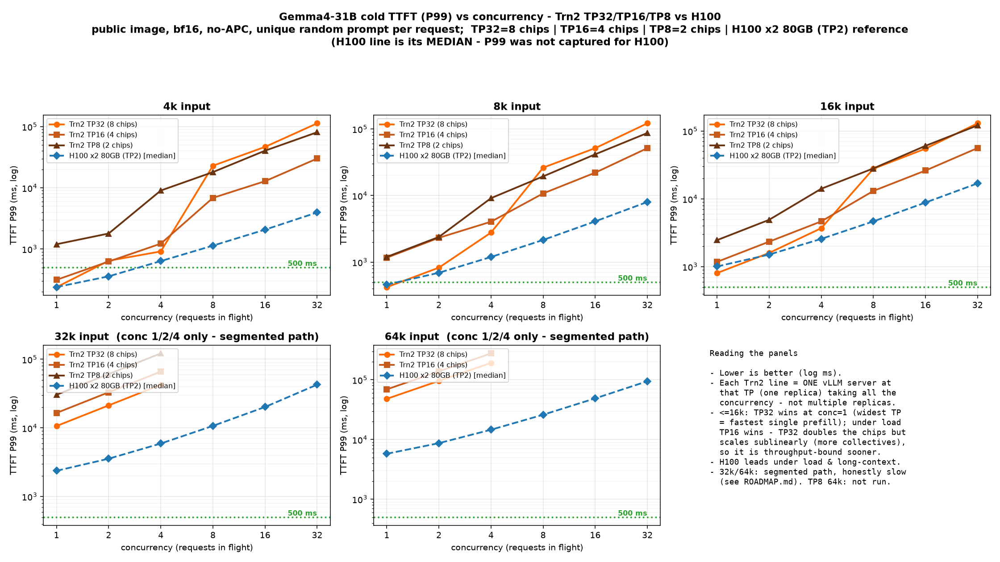
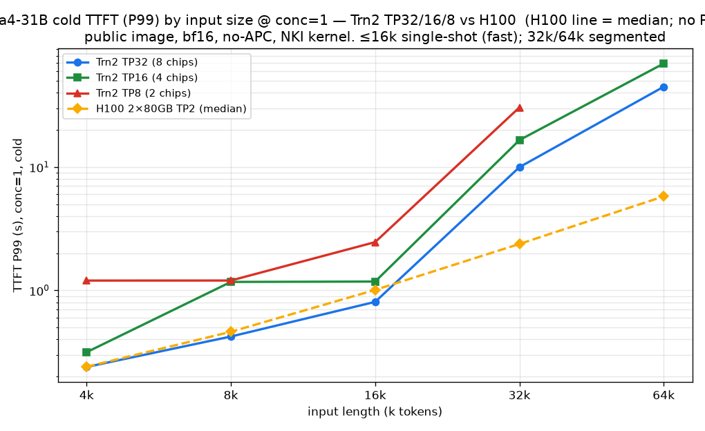
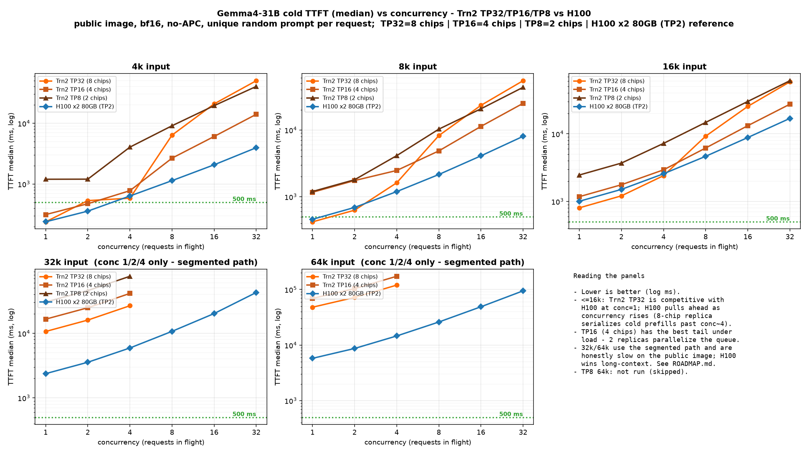
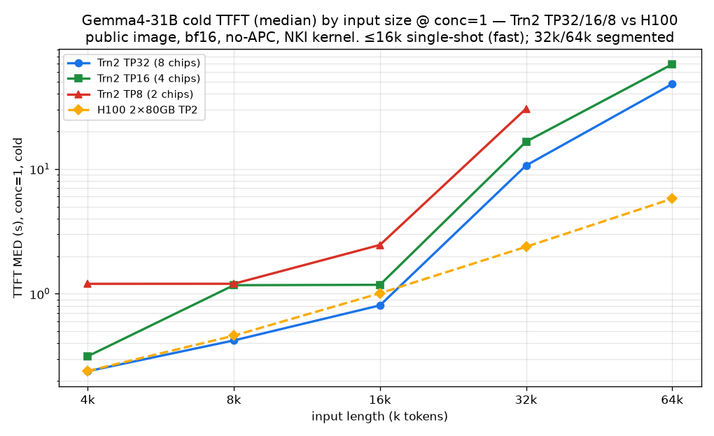
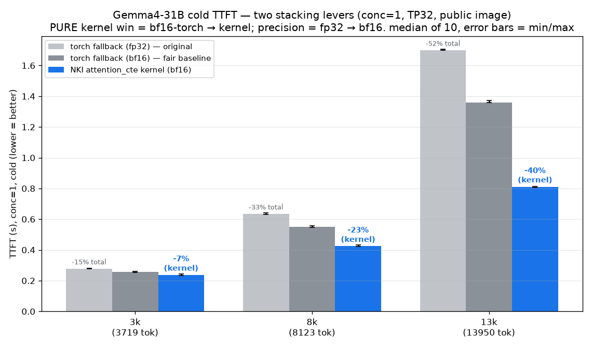

# Gemma4-31B on AWS Trainium2 — cold TTFT benchmark (public image, bf16, no-APC)

Serve and benchmark **`google/gemma-4-31B`** (text-only) on AWS Trainium2 (trn2.48xlarge) using the
**public** AWS Neuron vLLM image — **no private beta, no ECR allowlist, no FP8**. Every number below is a
genuine **cold** prefill: **bf16, prefix caching OFF, a unique random prompt per request** (so nothing is
served from cache). A custom **NKI prefill kernel** cuts ≤16k TTFT by up to **40%** vs the stock torch path.

> **New here? Start with this.**
> - **What this is:** measured TTFT (time-to-first-token) across inputs **4k / 8k / 16k / 32k / 64k**, a full
>   concurrency sweep **1→32**, and tensor-parallel degrees **TP32 / TP16 / TP8**, plus an H100 reference.
> - **Bottom line:** on the public image, cold, Trn2 TP32 serves **~0.24 s @4k, ~0.42 s @8k, ~0.81 s @16k**
>   (conc=1) — competitive with H100 at ≤16k. Long context (32k/64k) works but is slower (segmented path).
> - **Want to reproduce it?** You need: a trn2.48xlarge, the public DLC image (below), and gated access to
>   the Gemma4 weights. Then → [Reproduce in 3 steps](#reproduce-in-3-steps).
> - **Glossary:** *TTFT* = time to first token (prefill latency). *TPOT* = time per output token (decode).
>   *TP* = tensor-parallel degree (chips per replica). *APC* = automatic prefix caching (kept OFF here).
>   *cold* = unique random prompt, full prefill paid every request.

---

## TP scaling — P99 TTFT (TP32 vs TP16 vs TP8), cold


*Cold **P99** TTFT vs concurrency — **one panel per input size (4k / 8k / 16k / 32k / 64k)**, Trn2 **TP32
(8 chips) / TP16 (4 chips) / TP8 (2 chips)** vs the **H100 ×2 80GB (TP2)** reference (H100 line is its
**median**, shown dashed — P99 was not captured for H100). **Key insight: TP16 out-scales TP32 under load** —
past conc≈8 the 4-chip config's tail is far lower (4k conc32: TP16 ≈ 30 s vs TP32 ≈ 113 s). Each Trn2 line is a
**single vLLM server** (one replica) taking all the concurrency, so this is **not** replica parallelism: TP32
uses 2× the chips of TP16 but scales **sublinearly** (more all-reduce/collective communication per step), so
under load it becomes throughput-bound and its tail balloons, while the leaner TP16 sustains higher throughput.
Use TP32 for lowest single-request latency, TP16 for the best tail under load.
P99 is tail latency from a modest sample count per cell — indicative of behavior under load, not an SLA
guarantee.*


*Cold **P99** TTFT by input size at conc=1. At conc=1, P99 = median (single request). ≤16k uses the fast
single-shot NKI kernel; 32k/64k fall to the segmented path (slower — see [long-context](#long-context-3264k--honest)).
H100 line is median (P99 not captured this run).*

## TP scaling — median TTFT (the headline numbers)


*Cold **median** TTFT vs concurrency — **one panel per input size (4k / 8k / 16k / 32k / 64k)**, one colored
line per config: Trn2 **TP32 (8 chips) / TP16 (4 chips) / TP8 (2 chips)** vs **H100 ×2 80GB (TP2)**. Log–log so
the sub-second short-context and the tens-of-seconds long-context points are both readable. Each Trn2 line is a
**single vLLM server** at that TP (one replica) taking all the concurrency. **≤16k:** Trn2 TP32 wins at conc=1
(widest tensor-parallelism finishes one prefill fastest), but under load **TP16 pulls ahead** — TP32 uses 2× the
chips yet scales sublinearly (more collective communication over more ranks), so it is throughput-bound sooner
and its TTFT climbs faster; H100 leads under load. **32k/64k:** Trn2 ran conc 1/2/4
only (segmented path) and is honestly slower than H100 here — see [long-context](#long-context-3264k--honest).
TP8 64k not run. (H100 = quarter-box TP2 reference, prior session; full-box comparison would differ.)*


*Cold **median** TTFT by input size @ conc=1, Trn2 TP32/16/8 vs H100 2×80GB TP2. Trn2 TP32 matches H100 at
4k (0.24 s) and is close at 8k/16k; H100 wins long-context. (H100 = quarter-box TP2; full-box comparison
would differ.)*

## The NKI prefill kernel win (≤16k)


*Wiring Gemma4 prefill to the NKI `attention_cte` kernel vs the stock torch path. **Pure-kernel win: 7% @4k,
23% @8k, 40% @14k** (same bf16 precision). Stacked with the bf16 fallback (vs original fp32): **15/33/52%**.
median-of-10, error bars = min/max.*

---

## conc=1 TTFT (s) — the numbers to quote [measured-public]

| input (actual tokens) | TP32 (8 chips) | TP16 (4 chips) | TP8 (2 chips) | H100 ×2 80GB (TP2) |
|---|---:|---:|---:|---:|
| 4k (~3.7–4.2k) | **0.239** | 0.315 | 1.20 | 0.240 |
| 8k (~8.1k) | **0.422** | 1.17 | 1.20 | 0.461 |
| 16k (~15.1k) | **0.806** | 1.18 | 2.46 | 1.008 |
| 32k (~31k) † | 9.98 | 16.54 | 30.45 | 2.377 |
| 64k (~63k) † | 44.79 | 69.10 | (n/r) | 5.778 |

† 32k/64k use the **segmented** prefill path (much slower than ≤16k single-shot — this is a known cliff, not
smooth scaling). H100 wins long-context. **(n/r)** = not run (TP8 64k skipped). TP8 fit **up to 32k with no
OOM** — better than prior beta reports of TP8 OOMing at ≥16k.

> **Rigor note:** all TP32 conc=1 values are **median-verified** — ≤16k **median-of-10** (±0.003 s, reproduced
> 3×), 32k **median-of-10** (9.975 s ±0.001), 64k **median-of-6** (44.788 s ±0.001). Quote them freely.

Full median + P99 tables for every input × concurrency × TP → **[RESULTS.md](RESULTS.md)**.

---

## Reproduce in 3 steps

**1. Pull the PUBLIC image + start the container** (details in [SETUP.md](SETUP.md)):
```bash
docker pull public.ecr.aws/neuron/pytorch-inference-vllm-neuronx:0.21.0.1.0.0-neuronx-py313-sdk2.31.0-ubuntu24.04
bash scripts/run_container.sh   # mounts 16 Neuron devices + your model dir
```

**2. Get Gemma4 + apply the required text-only fix:**
```bash
hf download google/gemma-4-31B --local-dir /root/models/gemma-4-31b
python3 make_textonly.py         # builds /root/models/gemma-4-31b-text (strips vision config)
bash install_public.sh           # registers Gemma4 + applies the CTE-prefill & bf16 perf patches
```
> **Why text-only is required:** `gemma-4-31B` ships **multimodal** (`Gemma4ForConditionalGeneration` +
> `vision_config`). On the public plugin that routes to the vision path and crashes. `make_textonly.py`
> produces a `Gemma4ForCausalLM` text-only config so it serves cleanly.

**3. Run the benchmark — full sweep OR any subset:**
```bash
# full sweep (all inputs × concurrency × TP)
MODEL=/root/models/gemma-4-31b-text bash run_benchmark.sh

# just one input size
ONLY=16k MODEL=/root/models/gemma-4-31b-text bash run_benchmark.sh

# pick sizes, concurrency, TP degree
ONLY=4k,16k LEVELS=1,2,4 TP=16 MODEL=/root/models/gemma-4-31b-text bash run_benchmark.sh

# single fast smoke test
TP=32 ONLY=4k LEVELS=1 MODEL=/root/models/gemma-4-31b-text bash run_benchmark.sh
```
Results land in `results_<timestamp>/` (per-size JSON + `summary.csv`). One serve at a time → [LAUNCH.md](LAUNCH.md).

---

## What makes it fast (measured levers)

| Lever | Effect | Status |
|---|---|---|
| **NKI `attention_cte` prefill kernel** (hd256/512) | **7/23/40%** ≤16k (pure kernel) | ✅ measured-public |
| **bf16 attention** (vs original fp32 fallback) | +8/13/20% (stacks → 15/33/52%) | ✅ measured-public |
| **Fine prefill buckets** `[256..16384]` | big for short prompts (less padding) | ✅ measured |
| **TP32** | lowest single-request latency | ✅ measured |
| **`--async-scheduling`** | overlaps host dispatch | ✅ in the winning config |

> The `attention_cte` kernel and bf16 fallback are wired into the model as **patches applied by `install_public.sh`**
> (`patches/patch_manual_sdpa_cte.py`, `patch_bf16_fallback.py`) and **activated** by `GEMMA4_CTE_PREFILL=1` /
> `GEMMA4_BF16_FALLBACK=1` (set in `run_benchmark.sh` and `LAUNCH.md`). Without the patches those env vars are inert
> and ≤16k TTFT falls back to the slower torch path — so run `install_public.sh` before benchmarking.

## Configuration (defaults)

| Var | Default | Options | Notes |
|---|---|---|---|
| `ONLY` | `4k,8k,16k,32k,64k` | any subset | which input sizes |
| `LEVELS` | `1,2,4,8,16,32` | any subset | concurrency (32k/64k use `1,2,4`) |
| `TP` | `32` | `32,16,8` | tensor-parallel degree |
| `GEN` | `40` | int | output tokens |
| `APC` | `0` | `0,1` | prefix caching (keep 0 for cold numbers) |
| `MODEL` | — | path | the text-only dir from step 2 |

## What fits at each TP [measured-public]

| | 4k | 8k | 16k | 32k | 64k |
|---|---|---|---|---|---|
| **TP32** | ✅ | ✅ | ✅ | ✅ | ✅ |
| **TP16** | ✅ | ✅ | ✅ | ✅ | ✅ |
| **TP8** | ✅ | ✅ | ✅ | ✅ | (not run) |

TP32 = 8 chips (whole box, lowest single-request latency). TP16 = 4 chips — **best sustained throughput / tail
under load in these single-server runs** (and in production you can also fit 2 TP16 replicas per box for ~2×
aggregate throughput). TP8 = 2 chips (4 replicas/box; highest single-request latency but fit up to 32k on public).

## Long context (32k/64k) — honest

32k/64k run correctly on the public image (bf16, segmented SEG=2048) but are **slow** (32k ~10.0 s, 64k ~44.8 s
at conc=1, TP32) and H100 wins here. The cause is a hard path swap at 16k: ≤16k uses the fused NKI kernel;
>16k is forced onto a segmented torch path. Two fixes were investigated — see `ROADMAP.md`:
- **Segmented NKI kernel** — attempted; the math is CPU-validated but the kernel does not yet engage on the
  public image (falls back to torch). Documented in `SEGMENTED_SMOKE_RESULT.md`. Near-term, once the on-device
  fallback is diagnosed.
- **Context Parallelism (CP)** — the real long-context fix, but a multi-week effort: Gemma4 isn't shipped in
  the public plugin, DCP is wired only for llama3 and requires disaggregated serving + a new NKI kernel.
  See `ROADMAP.md`.

## Decode (TPOT)
~99–537 ms/token depending on TP (TP16/TP8 ≈ 99–170 ms, TP32 ≈ 537 ms) — fine for text chat (≈reading speed).

## Notes
- Every number is **cold** (unique random prompt, no cache reuse). For RAG best-case, enable APC — TTFT drops.
- **Base model:** `gemma-4-31B` is a base/pretrained checkpoint (no chat template) — use `/v1/completions`.
  The benchmark uses random tokens to measure prefill *latency*, not output quality.
- Public image = **neuronx-cc 2.26 / SDK 2.31**. Sub-second long-context numbers seen on the private beta do
  **not** reproduce here.
