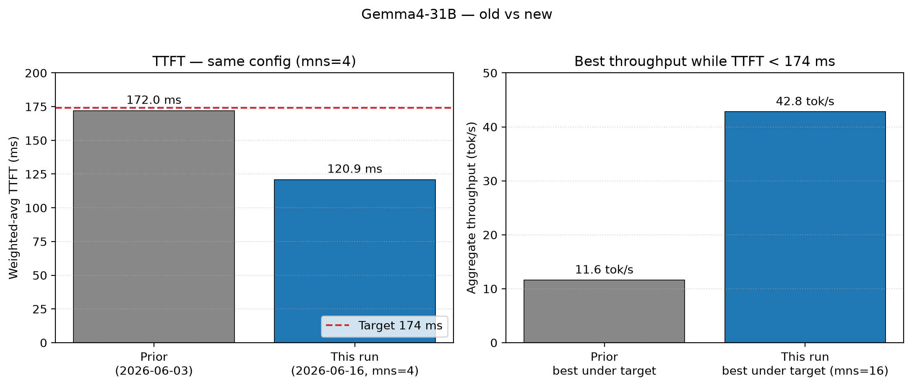
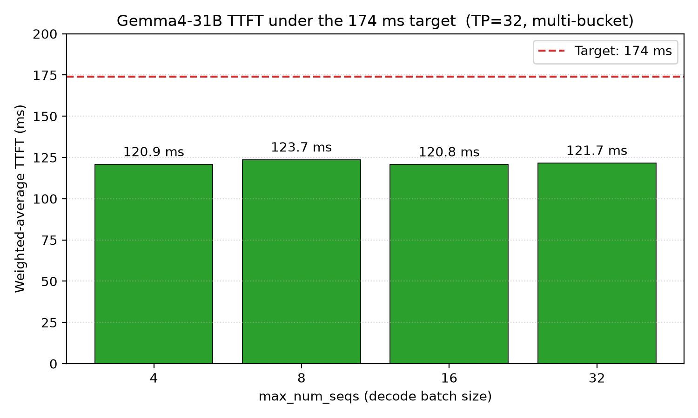
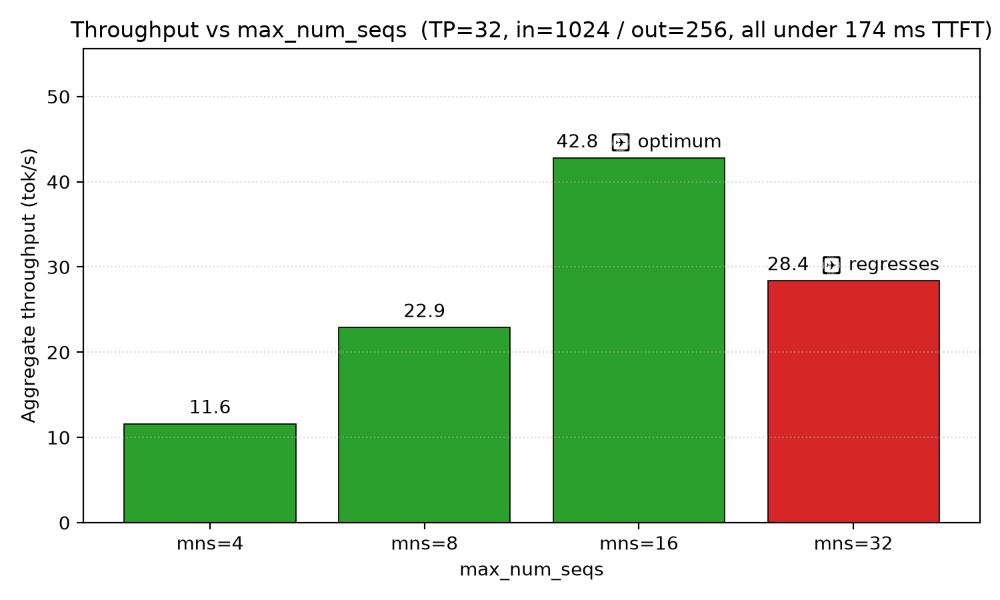
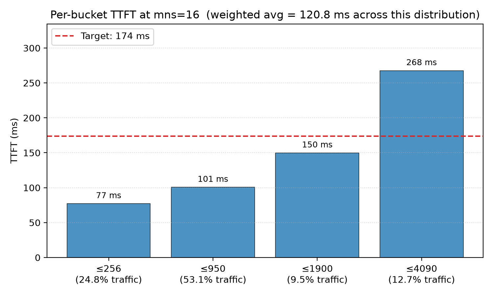

# Gemma4 31B IT on vLLM-Neuron (AWS Trainium2)

Serve Google's Gemma 4 31B IT on a trn2.48xlarge using the vLLM-Neuron plugin.

**121 ms weighted-average TTFT** on a real customer payload distribution, and
up to **42.8 tok/s** aggregate throughput under the 174 ms TTFT target
(TP=32, multi-bucket `[512, 1024, 2048, 4096]`, `max_num_seqs=16`).

> **Update 2026-06-16:** ships the updated model code (`gemma4/model.py` +
> new `gemma4/attention_decode_kernel.py`) and a full `max_num_seqs`
> throughput sweep. Weighted TTFT improved from 172 ms → 121 ms at the same
> config, and best throughput under the TTFT target rose from 11.6 → 42.8
> tok/s by tuning `max_num_seqs`. See [Changelog](#changelog-2026-06-16).







---

## Headline Results

All numbers measured on `trn2.48xlarge` (us-east-2), vLLM-Neuron v5 beta, bf16,
on-device greedy sampling. Raw JSONs in [`results/`](results/).

### Distribution-aware TTFT (matches a real customer payload mix)

Customer's payload distribution: 24.8% ≤0.5K, 53.1% ≤1K, 9.5% ≤2K, 12.7% ≤4K.
Measured with the updated code at `max_num_seqs=4`, multi-bucket. Raw data in
[`results/dist_mns4.json`](results/dist_mns4.json).

| Bucket | Share of traffic | Multi-bucket TTFT |
|---:|---:|---:|
| ≤0.5K | 24.8% | **78.1 ms** |
| ≤1K | 53.1% | **101.0 ms** |
| ≤2K | 9.5% | **149.1 ms** |
| ≤4K | 12.7% | **265.7 ms** |
| **Weighted average** | 100% | **🎯 120.9 ms** |



Weighted TTFT stays flat (~121 ms) across the whole `max_num_seqs` sweep
(4/8/16/32 → 120.9 / 123.7 / 120.8 / 121.7 ms) — decode batch size does not
affect prefill TTFT. See `results/dist_mns{4,8,16,32}.json`.


### Throughput vs `max_num_seqs` (TP=32, multi-bucket, in=1024 / out=256)

> Per-request decode (TPOT) is bound at ~2.9 tok/s by the head_dim>128 SDPA
> decode path. Aggregate throughput scales with `max_num_seqs` (more sequences
> decode in parallel) until the KV-cache ceiling. At `max_model_len=4096` the
> scheduler caps effective concurrency at **~23 requests**; setting
> `max_num_seqs=32` exceeds that and the server regresses on preemption.

| max_num_seqs | Weighted TTFT | Aggregate throughput | Per-req decode | vs baseline | Note |
|---:|---:|---:|---:|---:|---|
| 4 (prior baseline) | 120.9 ms | 11.6 tok/s | 2.9 tok/s | 1.0× | KV ceiling not hit |
| 8 | 123.7 ms | 22.9 tok/s | 2.9 tok/s | 2.0× | scales linearly |
| **16** | **120.8 ms** | **42.8 tok/s** | 2.7 tok/s | **3.7×** | ✅ optimum under target |
| 32 | 121.7 ms | 28.4 tok/s | — | 2.4× | ❌ regresses (KV cap ~23, preemption) |

Raw data in `results/thru_mns{4,8,16,32}.json`. **Recommended production
config: `max_num_seqs=16`** — 3.7× the baseline throughput at the same 121 ms
TTFT. To push past ~23 concurrent, raise `VLLM_NEURON_KV_GMU_BUDGET_CAP_FRACTION`
or lower `max_model_len`.

Reproduce the whole sweep with [`sweep_maxnumseqs.sh`](sweep_maxnumseqs.sh).

### Generation Proof

```
Prompt:  "The capital of France is"
TTFT:    292.6 ms
Output:  " Paris.\n\nThe capital of France is Paris.\n\n..."
TPOT:    343 ms (the head_dim>128 SDPA-fallback decode rate)
```


---

## What You Need

- A **trn2.48xlarge** instance (or any Trn2 with ≥32 NeuronCores)
- The **vLLM-Neuron Private Beta** container image (get from your AWS Neuron contact)
- A **HuggingFace token** with access to `google/gemma-4-31b-it` (gated model)
- This repo cloned somewhere accessible

## Step-by-Step

### Step 1 — Set environment variables

```bash
export HF_TOKEN=hf_xxxxxxxxxxxxxxxxxxxxx
export IMAGE=<your-vllm-neuron-beta-image-uri>
```

### Step 2 — Pull the image and install the matched Neuron driver

```bash
aws ecr get-login-password --region us-east-1 \
  | sudo docker login --username AWS --password-stdin 421672808698.dkr.ecr.us-east-1.amazonaws.com
sudo docker pull "$IMAGE"

# Extract and install the matched driver from the image
TMP=$(mktemp -d)
sudo docker create --name extract-driver "$IMAGE"
sudo docker cp extract-driver:/opt/aws/neuron/driver/. "$TMP/"
sudo docker rm extract-driver
# Ubuntu/Debian:
sudo dpkg -i $TMP/aws-neuronx-dkms_*.deb
# Amazon Linux:
# sudo dnf install -y $TMP/aws-neuronx-dkms-*.rpm
modinfo neuron | grep "^version"
```

### Step 3 — Start the container

```bash
sudo mkdir -p /data/{hf_cache,neff_cache,work}
sudo docker run -d --privileged --name vllm_neuron \
  -v /data/hf_cache:/root/.cache/huggingface \
  -v /data/neff_cache:/root/.cache/vllm \
  -v /data/work:/work \
  --env "HF_TOKEN=$HF_TOKEN" \
  --env "NEURON_SKIP_EFA_AFFINITY=1" \
  -p 8000:8000 --ipc=host \
  $(for i in $(seq 0 15); do echo --device /dev/neuron$i; done) \
  "$IMAGE" sleep infinity
```

### Step 4 — Copy this repo's code into the container

```bash
sudo docker cp gemma4/                 vllm_neuron:/work/pkg/gemma4/
sudo docker cp gemma4_register.py      vllm_neuron:/work/pkg/
sudo docker cp gemma4_transformers_stub.py vllm_neuron:/work/pkg/
sudo docker cp sitecustomize.py        vllm_neuron:/work/pkg/
sudo docker cp make_local_model.py     vllm_neuron:/work/pkg/
sudo docker cp bench_ttft.py           vllm_neuron:/work/pkg/
sudo docker cp bench_throughput.py     vllm_neuron:/work/pkg/
sudo docker cp bench_distribution.py   vllm_neuron:/work/pkg/
```

### Step 5 — Download model and patch tokenizer

```bash
sudo docker exec vllm_neuron python3 -c "
from huggingface_hub import snapshot_download
import os
print(snapshot_download('google/gemma-4-31b-it', token=os.environ['HF_TOKEN']))
"
sudo docker exec vllm_neuron python3 /work/pkg/make_local_model.py
```

This creates `/root/models/gemma-4-31b-it` with patched `tokenizer_config.json`
(checkpoint ships `extra_special_tokens` as a list; transformers 4.x needs a dict).


### Step 6 — Start the vLLM server

**Recommended config — multi-bucket, distribution-optimized (172 ms weighted avg):**

```bash
sudo docker exec -d \
  -e NEURON_SKIP_EFA_AFFINITY=1 \
  -e PYTHONPATH=/work/pkg \
  vllm_neuron \
  bash -c 'vllm serve /root/models/gemma-4-31b-it \
    --tensor-parallel-size 32 \
    --max-model-len 4096 \
    --max-num-seqs 4 \
    --max-num-batched-tokens 4096 \
    --additional-config '"'"'{"neuron_config":{"num_batched_tokens_buckets":[512,1024,2048,4096],"num_seqs_buckets":[4],"on_device_sampling_config":{"all_greedy":true}}}'"'"' \
    2>&1 | tee /work/serve.log'
```

**Alternative — single-bucket [4096] (flat 290 ms regardless of input size):**

Use this if all your prompts are around 4K tokens. Replace
`"num_batched_tokens_buckets":[512,1024,2048,4096]` with
`"num_batched_tokens_buckets":[4096]`.

**Alternative — single-bucket [1024] (102 ms for short prompts only):**

Use this if all your prompts are ≤1K. Set `--max-model-len 1024
--max-num-batched-tokens 1024` and `"num_batched_tokens_buckets":[1024]`.

First launch compiles the model (~5-8 min per bucket). Watch the log:

```bash
sudo docker exec vllm_neuron tail -f /work/serve.log
# wait for: "Application startup complete."
```

### Step 7 — Test it

```bash
curl http://localhost:8000/v1/completions \
  -H "Content-Type: application/json" \
  -d '{"model":"/root/models/gemma-4-31b-it","prompt":"The capital of France is","max_tokens":20,"temperature":0}'
```

Expected `"text": " Paris.\n\n..."`.

### Step 8 — Benchmark TTFT

```bash
# TTFT scan (single-bucket or multi-bucket — works for either)
sudo docker exec vllm_neuron python3 /work/pkg/bench_ttft.py \
  --model /root/models/gemma-4-31b-it \
  --seq-lens 256,512,1024,2048,3900 --runs 5 \
  --tag gemma4-tp32 --out /work/results.json

# Distribution-aware (matches the customer's payload mix)
sudo docker exec vllm_neuron python3 /work/pkg/bench_distribution.py
```

### Step 9 — Throughput sweep

```bash
sudo docker exec vllm_neuron python3 /work/pkg/bench_throughput.py \
  --model /root/models/gemma-4-31b-it \
  --concurrency 1,4,8,16 \
  --input-tokens 1024 --output-tokens 256 \
  --reqs-per-level 2
```


---

## Configuration Tips

### Why multi-bucket beats single-bucket on this workload

With single-bucket `[4096]`, every prompt is padded to 4096 tokens before the
kernel runs — a 256-token prompt pays the same 290 ms as a 4K prompt. With
multi-bucket `[512, 1024, 2048, 4096]`, each request lands in its smallest
fitting bucket: a 256-token prompt runs through the 512-bucket NEFF at 102 ms
instead of the 4K NEFF at 290 ms.

For workloads with mixed prompt lengths (most production traffic),
**multi-bucket is the right answer.** Use single-bucket only when context is
known and fixed.

### TP options

Gemma4 has 32 attention heads. Valid TP values: 1, 2, 4, 8, 16, 32.
TP=64 is impossible (32 not divisible by 64).

| TP | 4K TTFT |
|---:|---:|
| 16 | 452 ms |
| **32** | **293 ms** |

### Config constraints (vLLM-Neuron beta)

1. `max-num-batched-tokens` must be one of `[512, 1024, 2048, 4096]` OR equal to `max-model-len`.
2. The last entry in `num_batched_tokens_buckets` must equal `max-num-batched-tokens`.
3. `NEURON_SKIP_EFA_AFFINITY=1` is required on instances without EFA.

---

## How It Works (custom model registration)

Gemma4 is not in the vLLM-Neuron beta's built-in model list. This example
self-registers the model so `vllm serve` can use it:

1. **`sitecustomize.py`** — Python auto-imports this at startup. It runs
   `gemma4_transformers_stub.install()` (teaches `AutoConfig` about
   `model_type: gemma4`) and `gemma4_register.register()` (injects our model
   class into vLLM's `ModelRegistry`).
2. **`gemma4_register.py`** — Forces `Gemma4ForConditionalGeneration` into both
   `vllm_neuron.model.registry` and `vllm.ModelRegistry`. Includes a
   post-plugin hook that re-applies the registration after vLLM's plugin
   loader resets the registry.
3. **`gemma4/model.py`** — The model implementation with TP-sharded attention,
   heterogeneous SWA+Global layers, KV cache, and weight loading.

No vLLM fork needed. Everything runs via `PYTHONPATH`.

---

## Model Architecture

| | SWA Layers (49) | Global Layers (11) |
|---|---|---|
| head_dim | 256 | 512 |
| KV heads | 16 | 4 |
| Attention | Sliding window (1024) | Full causal |
| RoPE θ | 10,000 | 1,000,000 |
| RoPE coverage | 100% | 25% (partial) |
| V projection | Separate | K=V (copies K) |

Other features: QK normalization, V normalization, per-layer scalar, 4 norms
per layer, GeGLU activation, logit softcapping (30.0), tied word embeddings,
vocab 262144.

---

## Files

Every file below is on the live serve/bench path. No dead code.

```
├── README.md                        # This file
├── sitecustomize.py                 # Python auto-import → installs stub + registers Gemma4
├── gemma4_transformers_stub.py     # Teaches transformers' AutoConfig about model_type=gemma4
├── gemma4_register.py               # Registers Gemma4ForConditionalGeneration in vLLM's ModelRegistry
├── gemma4/                          # Model package — the runtime path
│   ├── __init__.py                  # exports the arch class
│   ├── README.md                    # model architecture notes
│   ├── factory.py                   # Gemma4ForConditionalGeneration (vLLM-facing wrapper)
│   ├── config.py                    # Gemma4Config + NeuronConfig glue
│   ├── attention_decode_kernel.py   # decode-attention kernel
│   └── model.py                     # The actual model: TP-sharded SWA+Global attn, GeGLU MLP,
│                                    #   QK/V norm, partial RoPE, logit softcap, weight loading.
│                                    #   Calls vllm_neuron.functional (NF.qkv_proj, NF.flash_attention,
│                                    #   NF.attention_decode, NF.o_proj, etc.).
├── make_local_model.py              # One-time: build /root/models/gemma-4-31b-it with patched tokenizer
├── sweep_maxnumseqs.sh              # max_num_seqs throughput sweep orchestrator (runs in-container)
├── bench_ttft.py                    # → ttft_single_bucket_*.json, ttft_multi_bucket*.json, ttft_8k_clean.json
├── bench_distribution.py            # → dist_mns*.json / ttft_distribution.json (weighted-avg TTFT)
├── bench_throughput.py              # → thru_mns*.json / throughput.json (concurrency sweep)
└── results/                         # Raw measurement JSONs
    ├── dist_mns{4,8,16,32}.json     # weighted-avg TTFT per max_num_seqs (2026-06-16)
    ├── thru_mns{4,8,16,32}.json     # throughput per max_num_seqs (2026-06-16)
    ├── ttft_single_bucket_1k.json   # TP=32, [1024] bucket scan (prior)
    ├── ttft_single_bucket_4k.json   # TP=32, [4096] flat scan (prior)
    ├── ttft_multi_bucket.json       # TP=32, [512,1024,2048,4096] per-bucket scan (prior)
    ├── ttft_8k_clean.json           # TP=32, [8192] bucket measurement (prior)
    ├── ttft_distribution.json       # Prior weighted-avg summary (172 ms)
    ├── throughput.json              # Prior concurrency sweep
    └── generation_proof.json        # End-to-end gen sample ("The capital of France is …")
```

## Changelog (2026-06-16)

This update ships the newer model code and a full `max_num_seqs` throughput
sweep. All numbers below are TP=32, multi-bucket `[512,1024,2048,4096]`,
trn2.48xlarge (us-east-2), vLLM-Neuron v5 beta, bf16, on-device greedy.

**Code changes**
- `gemma4/model.py` updated (1378 → 1657 lines)
- added `gemma4/attention_decode_kernel.py` (new decode-attention kernel)
- added `sweep_maxnumseqs.sh` (the throughput-sweep orchestrator)
- added `results/dist_mns{4,8,16,32}.json` and `results/thru_mns{4,8,16,32}.json`

**TTFT — improved ~30% at matched config (mns=4, multi-bucket)**

| Bucket | Prior (2026-06-03) | This run (2026-06-16) | Δ |
|---:|---:|---:|---:|
| ≤0.5K | 102.1 ms | 78.1 ms | −24% |
| ≤1K | 153.8 ms | 101.0 ms | −34% |
| ≤2K | 288.3 ms | 149.1 ms | −48% |
| ≤4K | 295.9 ms | 265.7 ms | −10% |
| **Weighted** | **172.0 ms** | **120.9 ms** | **−30%** |

**Throughput — best achievable under the 174 ms TTFT target**

| | Prior | This run | Δ |
|---|---:|---:|---:|
| Best aggregate throughput | 11.6 tok/s (`mns=4`) | **42.8 tok/s (`mns=16`)** | **3.7×** |
| Per-request decode (TPOT) | 2.9 tok/s | ~2.9 tok/s | unchanged |

**Honest attribution**
- The **TTFT gain** is measured at an identical config and bench, so it is
  attributable to the new code (largest gain in the mid-size buckets). The
  prior figure was measured 2026-06-03; a strict A/B (old code on this same
  box/cache) would remove any residual run-condition confound.
- The **throughput gain is a tuning win, not a per-token speedup.** Per-request
  decode is still ~2.9 tok/s (the new `attention_decode_kernel.py` did not lift
  the head_dim>128 decode bottleneck in this run). The 3.7× comes from raising
  `max_num_seqs` from 4 to 16 — which the lower TTFT now leaves headroom for.
- `max_num_seqs=32` **regresses** (28.4 tok/s) because the KV cache caps
  effective concurrency at ~23 at 4K context; beyond that the server thrashes
  on request preemption. `max_num_seqs=16` is the recommended setting.

## License

Apache-2.0
