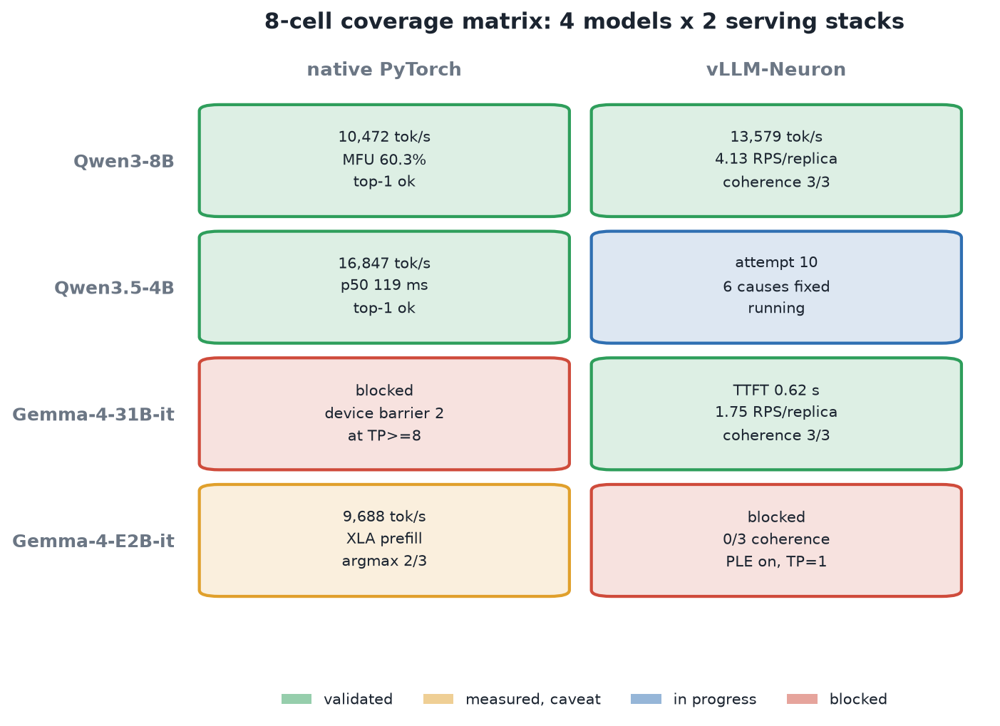
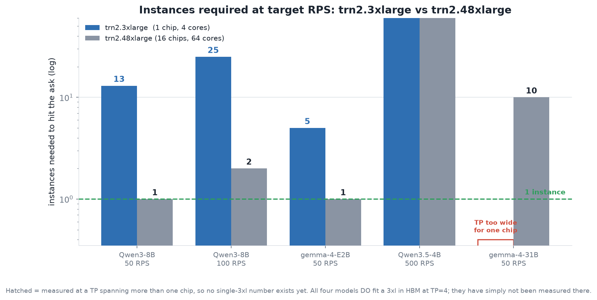

# Four models on Trainium2: native PyTorch and vLLM-Neuron

A capacity study of four models on `trn2.48xlarge`, each served two ways —
**native PyTorch (TorchNeuron)** and **vLLM-Neuron 0.21** — with every timing
gated behind a coherence check.

Two of the eight cells needed a port that did not exist. One of them still
does not work, and the writeup below says so.

## Coverage

| Model | native PyTorch | vLLM-Neuron |
|---|---|---|
| **Qwen3-8B** | 10,472 tok/s, MFU 60.3% | **13,579 tok/s**, 4.13 RPS/replica, coherence 3/3 — but only **46% of target** at 50 output tokens, even tuned ([findings](qwen3-8b-vllm-neuron/DECODE_CEILING.md)) |
| **Qwen3.5-4B** | 16,847 tok/s prefill, p50 119 ms | **validated 3/3**, tuned to **0.775 RPS/chip** = 14.4x stock ([port](qwen3.5-4b-vllm-neuron/), [throughput](qwen3.5-4b-vllm-neuron/THROUGHPUT.md)) |
| **Gemma-4-31B-it** | blocked — `device barrier 2` at TP>=8 | TTFT 0.62 s, 2.50 RPS/replica, coherence 3/3; **7.66 RPS/box at TP16**, MFU 16.0% ([findings](gemma4-31b-findings/PREFILL_FALLBACK.md)) |
| **Gemma-4-E2B-it** | 9,688 tok/s prefill (XLA), argmax 2/3 | **broken — 0/3** ([findings](gemma4-e2b-findings/)) |



## Instance sizing

`trn2.3xlarge` = **1** Trainium2 accelerator = 4 logical cores at LNC=2, 24 GB each.
`trn2.48xlarge` = **16** accelerators = 64 logical cores.
([EC2 accelerated computing specs](https://docs.aws.amazon.com/ec2/latest/instancetypes/ac.html))

Per-box RPS below is **measured per-replica RPS x (64 / TP)**. Multiplying across
replicas is an extrapolation: it assumes perfect scaling and no contention for
HBM bandwidth or host CPU. It is labelled as such in every chart.

| Model | in / out | RPS/replica | TP | RPS / 48xl | RPS / 3xl |
|---|---|---:|---:|---:|---:|
| Qwen3-8B | 3500 / 1 | 4.13 | 4 | 66.1 | 4.13 |
| Qwen3-8B *(50 out tok, `MNS=16`)* | 3460 / **50** | 0.963 | 4 | 15.4 | 0.963 |
| Qwen3-8B *(50 out tok, `MNS=8` tuned)* | 3460 / **50** | **1.438** | 4 | **23.0** | 1.438 |
| Gemma-4-E2B | 3500 / 1 | 2.77 | 1 | 177.3 | 11.08 |
| Gemma-4-31B-it | 3500 / 50 | 2.50 | 32 | 5.0 | — (spans 8 chips) |
| Gemma-4-31B-it | 3461 / 50 | 1.91 | 16 | 7.66 | — (spans 4 chips) |
| Qwen3.5-4B | 2000 / 50 | 0.157 | 4 | 2.5 | 0.157 |
| Qwen3.5-4B *(tuned)* | 1811 / 50 | **0.775** | 4 | **12.4** | 0.775 |

The two later rows are throughput work done after the original sweep. The tuned
Qwen3.5 row is 14.4x the stock configuration; the ledger is in
[`qwen3.5-4b-vllm-neuron/THROUGHPUT.md`](qwen3.5-4b-vllm-neuron/THROUGHPUT.md).

**31B at TP16 looks better per box than TP32** (7.66 vs 5.0): half the chips per
replica, four replicas instead of two, and 31B saturates at concurrency 16
regardless. Treat that as indicative, not measured — the two rows are separate
runs at different prompt lengths and serve configs, not a controlled A/B. It does
agree with the direction of the 31B repo's own TP sweep, which found TP16
out-scaling TP32 under load because TP32 pays more collective communication per
step.



Qwen3-8B at TP=4 occupies exactly one Trainium2 chip with 4.10 of 24 GB per core
and no cross-chip collectives — that configuration *is* a `trn2.3xlarge`. It was
measured on a 48xlarge, so it is hardware-equivalent for a single replica but has
not been run on real 3xl silicon.

All four models fit a single 3xl in HBM at TP=4 (31B is the tightest at
15.5 of 24 GB per core). The 31B and Qwen3.5 rows have no single-3xl number only
because they were measured at TP=32 and TP=4-with-decode respectively.

> ### ⚠️ The rows above are not measured on a common output length
>
> Qwen3-8B and Gemma-4-E2B are measured at **1 output token**; Gemma-4-31B and
> Qwen3.5-4B at **50**. Re-measuring Qwen3-8B at 50 output tokens under sustained
> load drops it from 65.7 to **15.4 RPS/box** — from 131% of its target to **31%**.
>
> Root cause: **the decode graph executes the full static `max_num_seqs` x context
> shape every step**, regardless of how many sequences are actually active, so the
> published run paid a 16-slot decode step to serve one sequence. Sweeping that
> knob lands on `max_num_seqs=8` for **23.0 RPS/box, 1.49x** the published config
> from a single flag. See
> [`qwen3-8b-vllm-neuron/DECODE_CEILING.md`](qwen3-8b-vllm-neuron/DECODE_CEILING.md),
> which also records three falsified hypotheses so they are not retried.
>
> Does it generalize? **Tested on Qwen3.5-4B: no.** Its decode does not scale with
> the bucket (best at 16), and its throughput is flat across the knob (0.779 vs
> 0.775 RPS/chip) because it is prefill-bound. So `max_num_seqs` matters when decode
> is on the critical path — worth *checking* per model, not assuming. Gemma-4-31B
> (MNS=32, 50 out tok) is still untested.
>
> **At 50 output tokens, none of the four models currently meets its target.**
> Assume the E2B row carries the same 1-output-token optimism until re-measured.

**Prefill-only numbers are not RPS.** The native Qwen3.5-4B figure above is
prefill only. Measured end to end on vLLM with 50 output tokens, the same model
does 0.157 RPS/replica — decode costs 6.4 s against prefill's 0.12 s, roughly
50x. Any capacity estimate built on a prefill number is optimistic by that ratio.

That ratio is not fixed, and on Qwen3.5 it inverted. After the DeltaNet prefill
kernel fix and block-count tuning, decode is 45% of e2e and prefill is the
binding constraint: the peak (0.775 RPS/chip) sits at 70% of the prefill-only
ceiling (1.105 RPS/chip), so **a free decode would buy at most 1.43x**. Re-derive
the split per configuration before choosing what to optimise — we spent a cycle
attacking decode on a model that had become prefill-bound.

## What is worth reusing

### [`qwen3-8b-vllm-neuron/`](qwen3-8b-vllm-neuron/) — dense Qwen3 port generator

vLLM-Neuron 0.21 registers **four** architectures: `Eagle3LlamaForCausalLM`,
`GptOssForCausalLM`, `LlamaForCausalLM`, `Qwen3VLForConditionalGeneration`. No
dense Qwen3.

`mk_qwen3.py` derives one from `qwen3_vl` rather than from `llama3`, because
`qwen3_vl` already threads Qwen3's QK-norm through `NF.qkv_proj`
(`qk_norm_pre_rope_*` in prefill, `rmsnorm_QK_pre_rope_W_*` in decode). Stripping
vision from a correct Qwen3 decoder is a smaller, safer diff than adding QK-norm
to several llama3 attention call sites. 14 asserted edits, coherence 3/3.

### [`qwen3.5-4b-vllm-neuron/`](qwen3.5-4b-vllm-neuron/) — six sequential blockers

Qwen3.5's hybrid GDN + attention model took eleven attempts. Six distinct causes,
each documented with the exact error text. Three were bugs in the *harness*, not
the model — including a patch that silently stole a `@torch.no_grad()` decorator.

### [`gemma4-e2b-findings/`](gemma4-e2b-findings/) — one real bug, two dead ends

E2B is still incoherent. Published because the negative results are expensive to
rediscover: two plausible root causes were **falsified by measurement**, and a
third real bug (`use_double_wide_mlp`, silently discarding half of every MLP
weight on 20 of 35 layers) was found and fixed without restoring coherence.

### [`gemma4-31b-findings/`](gemma4-31b-findings/) — the decode ceiling is real

A concurrency sweep to 128 showed 31B is **already saturated at concurrency 16**.
Also records that an existing d-tiled NKI decode kernel for head_dim 256/512
gives *no* speedup, because per-request decode is host-dispatch-bound.

[`PREFILL_FALLBACK.md`](gemma4-31b-findings/PREFILL_FALLBACK.md) adds the same
result for the **prefill** kernel, measured this time. 31B runs a
score-materializing torch SDPA fallback because `GEMMA4_V2_PREFILL` defaults off;
turning the NKI kernel on costs **33% throughput** (7.66 -> 5.14 RPS/box) at 3.5k
tokens. It provably engages (prefill NEFF 12.7 MB -> 51.5 MB) and stays coherent,
so this is a pure regression — and almost certainly why the flag ships off,
despite an in-file comment claiming "default on". Also: `verified_kernel_ab.json`
is not an A/B (its `kernel_off` side is `null`), and `GEMMA4_SWA_SKIP` is a no-op
in Public_Final (identical graph hash).

### [`qwen3.5-4b-vllm-neuron/THROUGHPUT.md`](qwen3.5-4b-vllm-neuron/THROUGHPUT.md) — 14.4x, and two null results

Qwen3.5 drives most of the fleet estimate (500 RPS target, 10x the others). Full
ledger from 0.054 to 0.775 RPS/chip: what worked (NKI decode, block count,
blocked triangular inverse), what the `num_gpu_blocks` ceiling is (**200**; 230
and 260 both die `NRT_RESOURCE`), and two things that measured null — a
transposed recurrent-state layout intended to kill the decode transposes, and a
4x decode difference between DLC builds that we explicitly do **not** claim
credit for.

## FP8

Worth knowing before picking an FP8 checkpoint: vLLM-Neuron's quantization parser
accepts `quant_method` of **`modelopt`** or **`compressed-tensors`** and raises on
anything else.

| Checkpoint | `quant_method` | vLLM-Neuron |
|---|---|---|
| `Qwen/Qwen3-8B-FP8` | `fp8` (block-wise, `weight_block_size [128,128]`) | rejected |
| `nvidia/Qwen3-8B-FP8` | `modelopt` | accepted |
| `RedHatAI/Qwen3-8B-FP8-dynamic` | `compressed-tensors` | accepted |

On the **native** path FP8 is not realizable today. All three checkpoints above
were measured through `neuron_worker.py` and came out identical, because
`--dtype` offers only bf16/fp32 and transformers dequantizes to the requested
compute dtype:

| | BF16 | FP8 block-wise | FP8 modelopt |
|---|---:|---:|---:|
| HBM peak (GB) | 11.6892 | 11.6882 | 11.6882 |
| tok/s | 10,472 | 10,455 | 10,447 |
| `params_est` | 9,096,396,800 | identical | identical |

If FP8 were live, HBM would drop substantially. It does not. Real FP8 for a dense
Qwen3 means deriving the port from `llama3/model_static_fp8.py` instead of
`qwen3_vl/model_bf16.py`.

## Reproducing the charts

```bash
cd results && python3 make_charts.py     # writes charts/*.png
```

Every number in `make_charts.py` is either traceable to a run in this study or
marked as an extrapolation in the code.

## Method

Timings are refused unless the model first answers three factual probes in the
same serving configuration. That rule exists because an earlier session reported
an 11.4x "speedup" measured on a model producing garbage, and had to retract it.

Two failure modes worth knowing about:

- **A readiness loop must prove the server is alive**, not merely un-ready. One
  run here logged `compiling (1213s)` for eighteen minutes at a process that had
  died at 130 s. `grep -c 'neuronx-cc|Compiling|NEFF'` on the serve log is the
  cheap tell: zero means it is not compiling, whatever the elapsed timer says.
- **Coherence gates false-negative on reasoning models.** Qwen3 and Qwen3.5 emit
  a thinking preamble; `max_tokens=32` truncated the answer and scored 0/3 on a
  model that was completely correct. Use
  `chat_template_kwargs: {"enable_thinking": false}` or raise the token budget,
  and read the sample text before concluding the model is broken.

## Environment

- `trn2.48xlarge`, LNC=2 (64 logical cores x 24 GB)
- vLLM: `public.ecr.aws/neuron/pytorch-inference-vllm-neuronx:0.21.0.1.0.0-neuronx-py313-sdk2.31.0-ubuntu24.04`
  (vllm 0.21.0, vllm_neuron 0.21.0.1.0.0, transformers 5.14.1, py3.13)
- native: TorchNeuron DLC, torch 2.12.1, torch_neuronx 2.12.3.0.1636, neuronx-cc 2.27.2878.0
- Compile budget: ~31 min hard pod wall. Several results are shaped by it — see
  the Qwen3.5 notes on `max_num_seqs=32` exceeding it during compilation.

## License

Model licenses are the vendors': [Gemma Terms of Use](https://ai.google.dev/gemma/terms),
[Qwen license](https://huggingface.co/Qwen). Code here is Apache-2.0.
