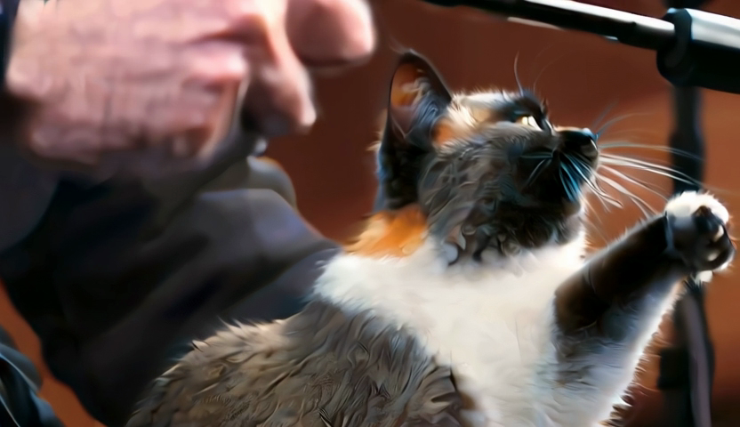

# Wan 2.2 TI2V-5B — native-PyTorch port + optimization on AWS Trainium2

Porting the **Wan 2.2 TI2V-5B** text-to-video diffusion model (Apache-2.0) to a single
**AWS Trainium2 (trn2.3xlarge)** in native PyTorch (`torch.compile(backend="neuron")`), with an
end-to-end pipeline (T5 text-encode → DiT denoise → VAE decode), correctness validation, tensor
parallelism, and a step-skipping (TeaCache) speed lever. All numbers are **measured on-device**.

Config: 480×832, 49 frames, 50 steps, CFG×2 (100 DiT forwards). Prompt: *"a cat playing piano, cinematic."*

## Headline
- **DiT forward: 9869 ms (naive native eager) → 331 ms** (TP=4) — **~30× via the optimizations below**,
  parity cos 0.9991 vs single-core.
- **End-to-end: 69.3 s (measured), fully on Neuron** — T5 0.704 s + DiT 51.1 s + VAE 15.3 s + export.
  Correctness PASS (decode PSNR 56.6 dB, SSIM 0.9994). (Text-encode on CPU had inflated this to ~134 s;
  moving T5 on-device — 0.7 s vs 65 s — was the fix.)
- **vs the GPU (H100) reference of 33 s: ~2.1×** on one chip. The remaining gap is DiT denoise (compute-
  bound at 511 ms/fwd) + VAE; a multi-chip trn2.48xl is the path to close it.

## Example output


*A frame from the exact (no-cache) output, generated end-to-end on one Trainium2 chip. Full clips and the
TeaCache variants are in `results/`.*

## Measured configurations (see `results/` for videos + frames)
All stages run on Neuron (T5 text-encode included, 0.704 s on-device).

| Config | Full e2e (all on Neuron) | H100 ref | Gap vs H100 | Fidelity |
|---|---|---|---|---|
| Exact (TP=4, no cache) | **69.3 s** (measured) | 33 s | 2.1× | reference, correctness PASS |
| TeaCache 54% skip | ~53 s | 33 s | 1.6× | softer (different sample) |
| TeaCache 74% skip | ~34 s | 33 s | ~1.0× (≈ parity) | hazy (un-calibrated) |

*No-cache was re-run end-to-end (69.3 s, measured). TeaCache rows = measured DiT+VAE pipe (50.4 s / 31.4 s)
+ the 0.704 s on-device T5 + export. Stage split of the exact run: T5 0.7 s + DiT 51.1 s + VAE 15.3 s.*

## What made it work (see `docs/OPTIMIZATION_NOTES.md`)
- **RoPE scatter-free rewrite** — the interleaved rotary embedding's strided index-assignment lowered to
  a scatter that crashed the compiler and crippled eager. Rewriting it `torch.stack([o1,o2],-1).flatten(-2)`
  (bit-identical) was the unlock: eager 9869 → 1773 ms, then `torch.compile` → 943 ms.
- **Tensor parallelism (TP=4)** via DTensor — Colwise q/k/v + ffn.0, Rowwise o + ffn.2, with an adaptive
  across-heads QK-RMSNorm all-reduce so sharding stays numerically exact. 943 → 331 ms/forward.
- **bf16 VAE decode** — 3× over fp32, parity PSNR 56.8 dB.
- **TeaCache** step-skipping — training-free; needs a calibrated rescale to hold fidelity at high skip.
- **Honest note:** isolated microbenchmarks (331 ms/fwd) ≠ the glued pipeline (511 ms/fwd + per-step
  scheduler/coordination overhead). The e2e numbers here are from the real glued run.

## Reproduce (trn2.3xl, Neuron native-PyTorch stack)
```
torchrun --nnodes 1 --nproc_per_node 4 src/e2e_tp4_teacache.py --threshes 0.05,0.10
```
Weights: `Wan-AI/Wan2.2-TI2V-5B-Diffusers` (Apache-2.0). Flags:
`NEURON_CC_FLAGS="--model-type=transformer -O2 --auto-cast=none"` (DiT) / `--model-type=unet-inference -O1` (VAE).

## Attribution
Built on **Wan 2.2 TI2V-5B** by Wan-AI (Apache-2.0) and **🤗 diffusers** (Apache-2.0). Generated video
outputs are unrestricted under the model's license.
